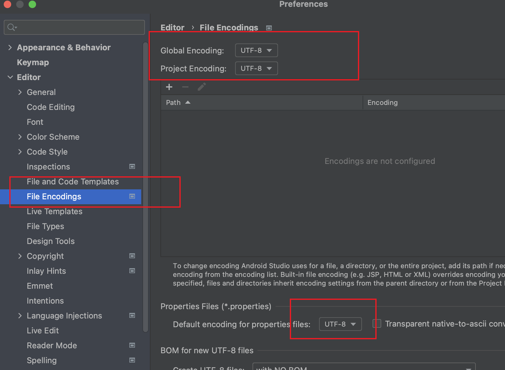
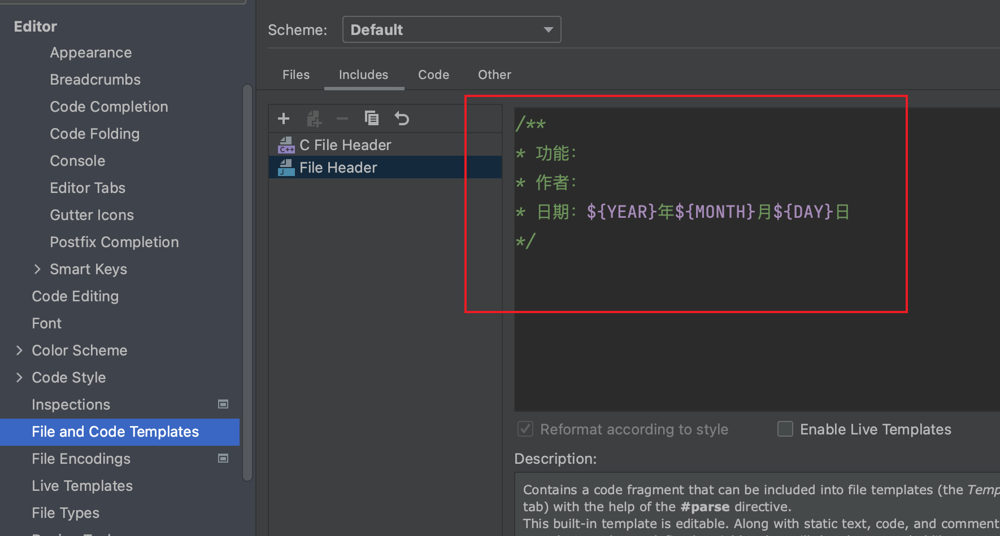
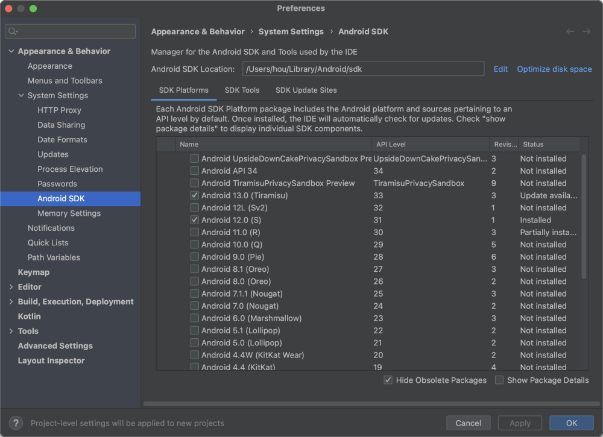

> 当前文件是`chapter00.md`

## 0.基础知识

## 1.平台架构

官方文档：
- https://developer.android.google.cn/guide/platform

`Android` 是一种基于 `Linux` 的开放源代码软件栈，为各类设备和机型而创建。下图所示为 `Android` 平台的主要组件。

  

从底层到上面的通用解释：

### Linux 内核
Android 平台的基础是 `Linux` 内核。例如，`Android Runtime` (`ART`) 依靠 `Linux` 内核来执行底层功能，例如线程和低层内存管理。

### Hardware Abstraction Layer
硬件抽象层 (HAL) ，提供标准界面，向更高级别的 Java API 框架显示设备硬件功能。HAL 包含多个库模块，其中每个模块都为特定类型的硬件组件实现一个界面，例如相机或蓝牙模块。当框架 API 要求访问设备硬件时，Android 系统将为该硬件组件加载库模块。

### Android Runtime

对于运行 Android 5.0（API 级别 21）或更高版本的设备，每个应用都在其自己的进程中运行，并且有其自己的 `Android Runtime` (ART) 实例。ART 编写为通过执行 `DEX` 文件在低内存设备上运行多个虚拟机，`DEX` 文件是一种专为 Android 设计的字节码格式，经过优化，使用的内存很少。编译工具链（例如 Jack）将 Java 源代码编译为 `DEX` 字节码，使其可在 Android 平台上运行。

`ART` 的部分主要功能包括：
- 预先 (`AOT`) 和即时 (`JIT`) 编译
- 优化的垃圾回收 (`GC`)
- 分析诊断、崩溃报告

### 原生 C/C++ 库

一些 C 和 C++ 编写的原生库，例如可以通过 Android 框架的 `Java OpenGL API` 访问 `OpenGL ES`，以支持在应用中绘制和操作 2D 和 3D 图形。
如果开发的是需要 C 或 C++ 代码的应用，可以使用 [Android NDK](https://developer.android.google.cn/ndk) 直接从原生代码访问某些原生平台库。

### Java API 框架

以 Java 语言编写的 API 使用 Android OS 的整个功能集（和一些系统框架）（组件和服务）。

### 系统应用

系统自带的一些应用， 比如要自己的App里需要有发短信的功能，就无需自己构建，直接调用系统的App功能即可。

## 2.应用组件

Android开发四大组件：
- Activity（活动）
    - Android 中，`Activity`是所有程序的根本，所有程序的流程都运行在`Activity`之中，`Activity`可以算是开发者遇到的**最频繁**，也是Android当中最基本的模块之一
    - 一般一个Android应用是由多个`Activity`组成的。这多个`Activity`之间Android的应用可以进行相互跳转。

- Service（服务）
    - `Service`是Android系统中的一种组件，它跟`Activity`的级别差不多，但是他不能自己运行， 只能**后台运行**，并且可以和其他组件进行交互。`Service`是**没有界面**的长生命周期的代码。
    - 举个例子，打开一个音乐播放器的程序，这个时候若想上网了，那么，打开Android浏览器，这个时候虽然已经进入了浏览器这个程序，但是，歌曲播放并没有停止，而是在后台继续一首接着一首的播放。其实这个播放就是由播放音乐的`Service`进行控制。

- Broadcas Receiver（广播接收器）
    - 在Android 中，`Broadcast`是一种广泛运用的在应用**程序之间传输信息的机制**。

- Content Provider（内容提供者）
    - `Content Provider` 是Android提供的**第三方应用数据的访问方案**
    - 在Android中，对数据的保护是很严密的，除了放在SD卡中的数据，一个应用所持有的数据库、文件等内容，都是**不允许其他直接访问**的。Android当然不会真的把每个应用都做成一座孤岛，它为所有应用都准备了一扇窗，这就是`Content Provider`。

## 3.Java SDK
安装`Android Studio`之前，需要先在电脑安装和配置Java环境。

Java-SDK的下载网址：
- https://www.oracle.com/java/technologies/downloads/

> 配置Java环境变量自行搜索即可

## 4.开发工具

**Android Studio**
`Android Studio`是谷歌推出的一个Android集成开发工具，基于`IntelliJ IDEA`。基于`Gradle`的构建支持。

`Android Studio`下载官网地址：
- https://developer.android.google.cn/studio

`Gradle Build Tool`：
- https://gradle.org/

👇🏻将项目文件的字符编码设置为`UTF-8`：

  

👇🏻可以设置项目文件的头部注释：

  

`Android Studio`的外观字体设置：`Settings` --> `Appearance & Behavior` --> `Appearance`

| 技巧 | 解释 | 备注 |
| --- | --- | --- |
| option + enter 快捷键 | 鼠标放某方法之后，可以快速生成返回值变量 | |

## 5.Android SDK

在下载[Android Studio](https://developer.android.google.cn/studio)网站页面，往下翻，即可看到`Android Studio`下载链接和`Android SDK`的下载链接。

> `Android Studio`中包含命令行工具，也就是`Android SDK`。建议直接下载`Android Studio`，在`Android Studio`的`SDK Manager`里面下载想要的`Android SDK`版本和`SDK Tools`

  

