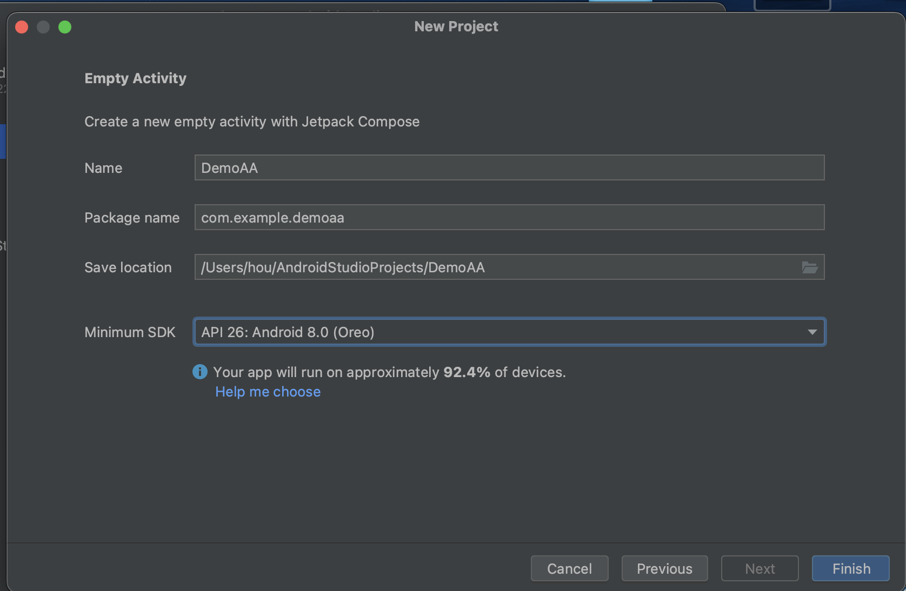
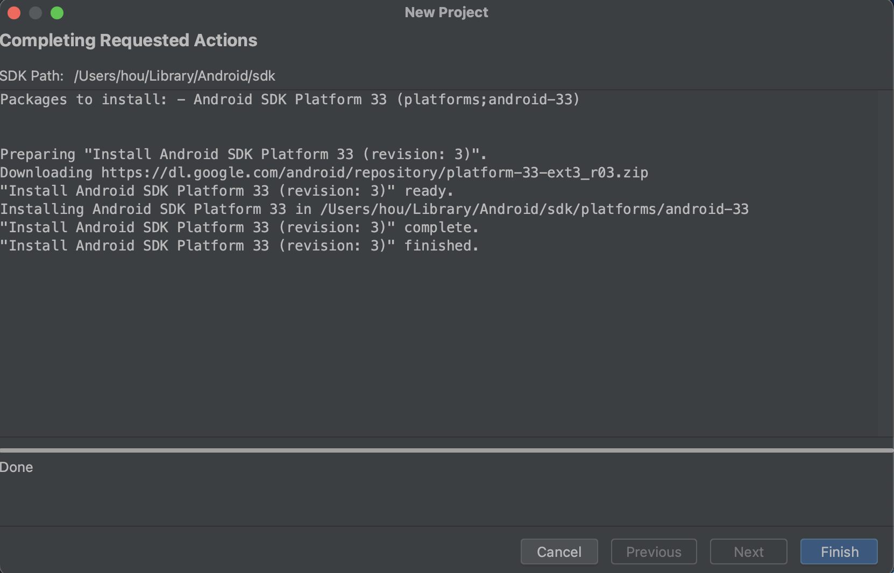
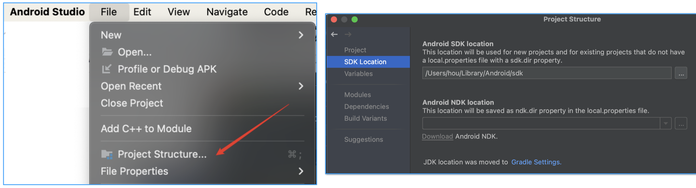
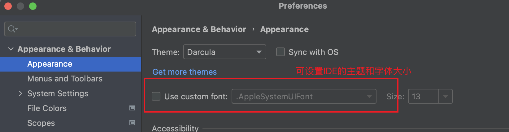
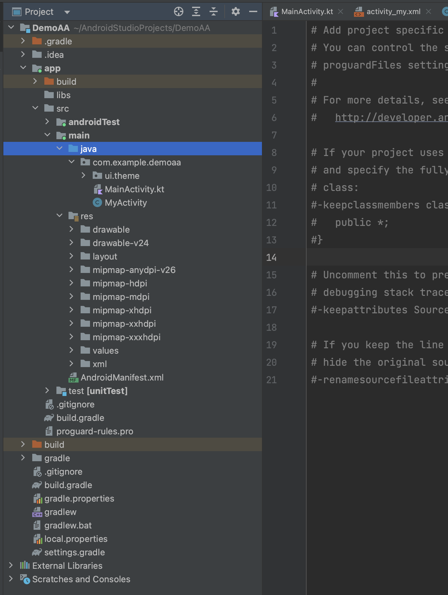

## 1.创建工程

安卓[**开发官网**](https://developer.android.com/)，里面有开发者指南（教程、API参考、设计准则...）。

- 网址：https://developer.android.com/


### 1.1 创建一个空白工程示例：

创建时，选择`Empty Activity`，填入工程名、包名等。

<p align="center">
  
</p>

<p align="center">
  
</p>

> 点击`Finish`之后，会初始化工程，下载对应的依赖，最好开启科学网。

> 😄新建项目的时候，选择`Empty Activity`是默认`kotlin`开发语言；如果选择`No Activity`(有的是`Empty Activity`)就可以选择是`Java`还是`kotlin`。

### 1.2 项目设置

在`File`->`Project Structure`中，可以设置项目的SDK、`Gradle`版本等：


`Android Studio`本身的菜单字体设置方法是：


## 2.工程结构

<p align="center">
  
</p>

- `.gradle`和`.idea`：这两个目录下都是Android Studio自动生成的，不用去管，不用手动编辑。
- `app` 项目中的代码、资源等几乎都在这里，后面开发也基本在这里
- `gradle` 构建器
  - `gradle-wrapper.properties`里会有gradle版本，`gradle-wrapper`会自动搜索是否有这个对应的`gradle`的版本，如果没有就会自动下载。
  - 可以在设置里看到`gradle` 的JDK依赖情况

- `build.gradle` 项目构建的全局脚本，通常内容不需修改。
- `gradle.properties` 全局的`gradle`配置文件，这里配置的属性将会影响到项目中所有的`gradle`编译脚本。
- `local.properties` 用于指定本机中`AndroidSDK`路径，通常内容是自动生成，除非本机SDK位置发生变化，否则无须修改。
- `settings.gradle` 用于指定项目中所有引入的模块，新工程demo只有一个`app`模块，所以该文件中就只引入了`app`这一个模块。通常模块的引入都是自动完成的。

总结：
```
├── app  # 一个模块(Module)，一个项目可以都多个模块
│   ├── build  # 编译产生的缓存目录
│   ├── build.gradle  # 这个模块编译相关的配置(比如依赖的三方库)，是Groovy语法
│   ├── libs  # 依赖相关，例如 jar，aar
│   ├── proguard-rules.pro  # 混淆规则文件
│   └── src
│       ├── androidTest  # 单元测试代码
│       ├── main  # 源码，配置和资源文件
│       │   ├── AndroidManifest.xml
│       │   ├── java  # 源码目录
│       │   └── res  # 资源目录，包括图片，布局，声音，视频，动画等资源
│       └── test  # 单元测试代码
├── build.gradle  # 项目模块的配置文件
├── gradle  # gradle配置目录
│   └── wrapper
│       ├── gradle-wrapper.jar
│       └── gradle-wrapper.properties  # 例如 gradle 版本配置
├── gradle.properties  # 自定义gradle配置
├── gradlew  # 对gradle命令的一个Unix系统包装
├── gradlew.bat  # 对gradle命令的一个Windows系统包装
├── local.properties  # 本地的配置文件
└── settings.gradle  # 当前项目的设置文件
```

项目设置 gradle：

<p align="center">
  
</p>


