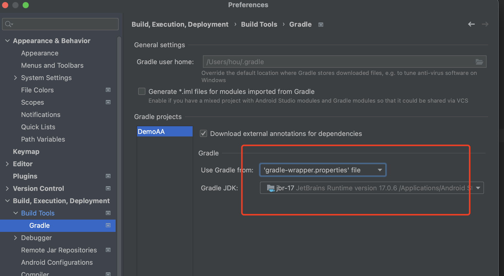

## 1.创建工程

安卓[**开发官网**](https://developer.android.com/)，里面有开发者指南（教程、API参考、设计准则...）。

- 网址：https://developer.android.com/

### 1.1 创建一个空白工程示例：

创建时，选择`Empty Activity`，填入工程名、包名等

> 点击`Finish`之后，会初始化工程，下载对应的依赖，最好开启科学网。

> 😄新建项目的时候，选择`Empty Activity`是默认`kotlin`开发语言；如果选择`No Activity`就可以选择是`Java`还是`kotlin`

### 1.2 项目设置
在`File`->`Project Structure`中，可以设置项目的SDK、`Gradle`版本等：

`Android Studio`本身的菜单字体设置方法是：

### 1.3 安卓工程介绍：

- `.gradle`和`.idea`：这两个目录下都是Android Studio自动生成的，不用去管，不用手动编辑。
- `app` 项目中的代码、资源等几乎都在这里，后面开发也基本在这里
- `gradle` 构建器
  - `gradle-wrapper.properties`里会有gradle版本，`gradle-wrapper`会自动搜索是否有这个对应的`gradle`的版本，如果没有就会自动下载。
  - 可以在设置里看到`gradle` 的JDK依赖情况

- `build.gradle` 项目构建的全局脚本，通常内容不需修改。
- `gradle.properties` 全局的`gradle`配置文件，这里配置的属性将会影响到项目中所有的`gradle`编译脚本。
- `local.properties` 用于指定本机中`AndroidSDK`路径，通常内容是自动生成，除非本机SDK位置发生变化，否则无须修改。
- `settings.gradle` 用于指定项目中所有引入的模块，新工程demo只有一个`app`模块，所以该文件中就只引入了`app`这一个模块。通常模块的引入都是自动完成的。

