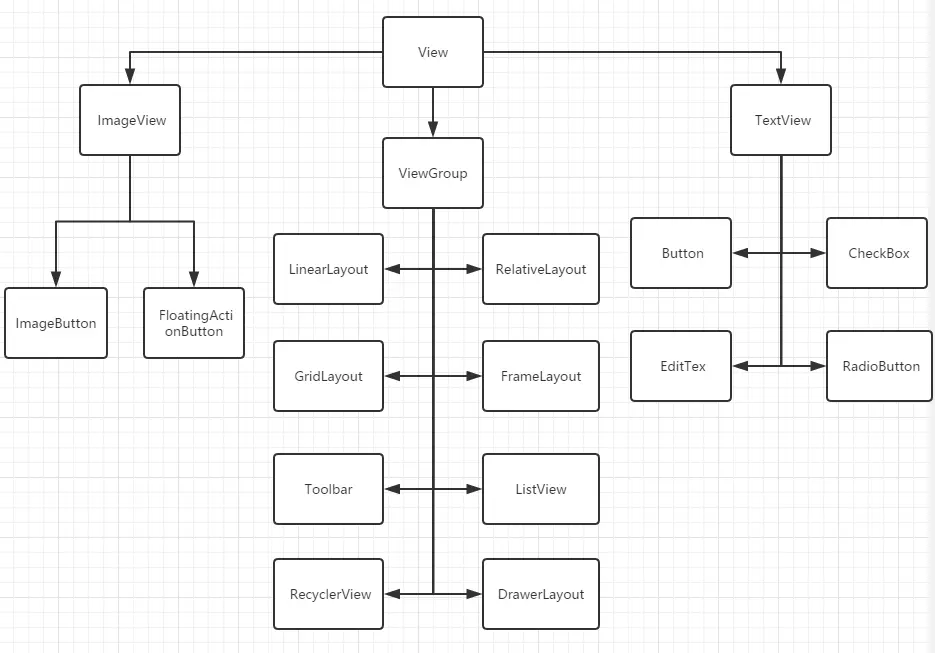
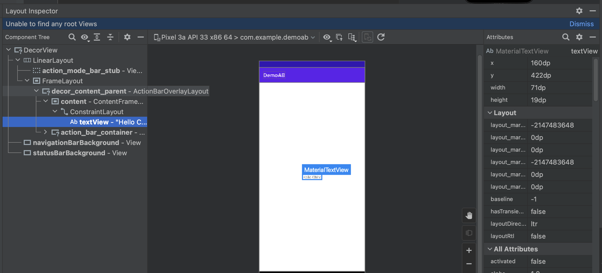
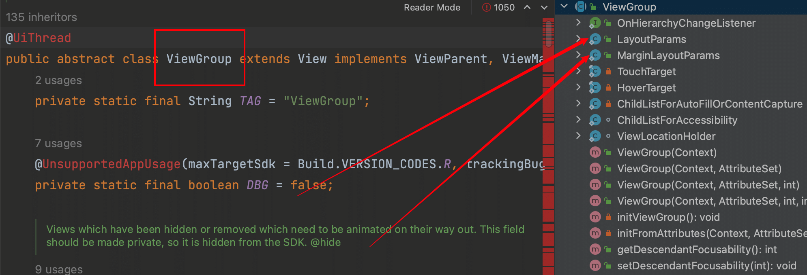
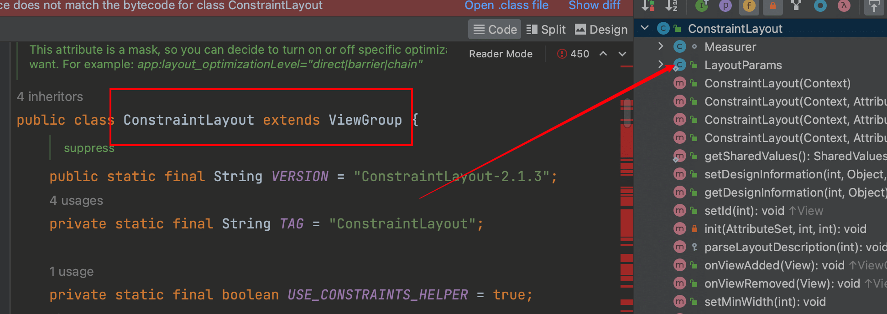
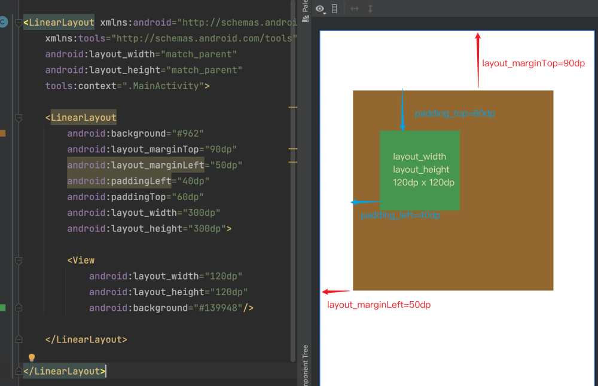

## 1.Android UI

Android UI 都是由**布局Layout**和**控件View**组成的。

在 Android 所有的控件`View`和 `Layout` 都有着一个父类 `View`。而大部分的 `Layout` 都继承自 `ViewGroup` 。一个 `ViewGroup` 可以包含别的 View 或 `ViewGroup` 。所以一个视图的根布局，通常是一个 `ViewGroup` 

常用的 `ViewGroup` 子类比如`LinearLayout` ， `RelativeLayout` ， `GridLayout` 等 Layout。还有一些控件，这些控件同样有着包含别的 `View` 或 `ViewGroup` 的功能。比如 `RecyclerView` ， `AdapterView。`
可能你会问，这个 `AdapterView` 是什么玩意。其实这个是我们常用的 `GridView`, `ListView` 的父类，换句话说，`GridView`, `ListView` 也属于 `ViewGroup` ，他们都能包含其他的 `View` 或 `ViewGroup`。

`TextView` 也是一个强大的父类，其中常见的有 `Button`，`EditText`，`CheckBox`，`RadioButton` 等，我们发现啊。。貌似只要带有文字的控件基本都来继承自 `TextView`。这是他作为父类的特点。


所以上图中三个子类是整个 `View` 体系中比较重要的，其中以 `ViewGroup` 最为繁杂，派生类最多，而且其中有控件，有布局。`TextView` 则以子类控件继承为主。`ImageView` 的话相对需求较少。

官方`View`的API文档：
- https://developer.android.com/reference/android/view/View


```
         View
         /  \
        /    \
ViewGroup    ViewParent
       |       |
       |       |
    ViewGroup ViewGroup.LayoutParams
              |
              |
           ViewGroup
           /   \
          /     \
      View      ViewParent
```
总结：
- `View`是所有UI组件的基类。
- `ViewGroup`是一个特殊的`View`，它可以包含其他视图（包括其他`ViewGroup`）。
- `ViewParent`是一个接口，它定义了`View`和`ViewGroup`父级的合同。
- `ViewGroup.LayoutParams`是一个`ViewGroup`的子类，它指定了`View`在其父`ViewGroup`中的布局参数。

## 2.布局 Layout
布局(`Layout`)定义应用中的界面结构(例如 `Activity` 的界面结构)。布局中的所有元素均使用 `View` 和 `ViewGroup` 对象的层次结构进行构建。`View` 通常绘制用户可查看并进行交互的内容。而`ViewGroup` 是不可见容器，用于定义`View`和其他`ViewGroup`对象的布局结构。

<p align="center">
  
</p>

- `View`对象通常称为**小部件**，可以是许多子类之一，例如`Button`或`TextView`。
- ViewGroup对象通常称为布局，可以是提供不同布局结构的多种类型之一，例如 `LinearLayout` 或 `ConstraintLayout`

有两种方式声明布局：
- **在 XML 中声明 UI 元素**。Android提供了`View`和`ViewGroup`相对应的简单 XML 词汇表，在XML直接进行代码布局，也可以使用`Android Studio`的`Layout Editor`进行拖放 XML 布局.

- **在运行时实例化布局元素**。用代码创建`View`和`ViewGroup`对象

> 在用代码创建`View`和`ViewGroup`对象，在运行时，调试视图的方法是：
> 1.在设备或模拟器上[运行App]
> 2.在菜单里 `Tools` > `Layout Inspector`
> 3.在显示的 `Choose Process` 对话框里面，现在对应的应用进程即可



### 2.1 编写XML
编写XML有下面几个注意点：
- 每个布局文件**必须只包含一个根元素**，该元素必须是一个`View`或`ViewGroup`对象
- 定义根元素后，可以**添加其他布局对象或控件**，以逐步构建`View`定义布局的层次结构
- 编写的XML文件，以`.xml`扩展名将文件保存在Android项目的`res/layout/`目录下，以便正确编译。

```xml
<?xml version="1.0" encoding="utf-8"?>
<!-- 使用LinearLayout布局，包含一个文本和一个按钮的例子 -->

<LinearLayout xmlns:android="http://schemas.android.com/apk/res/android"
              android:layout_width="match_parent"
              android:layout_height="match_parent"
              android:orientation="vertical" >
    <TextView android:id="@+id/text"
              android:layout_width="wrap_content"
              android:layout_height="wrap_content"
              android:text="Hello, I am a TextView" />
    <Button android:id="@+id/button"
            android:layout_width="wrap_content"
            android:layout_height="wrap_content"
            android:text="Hello, I am a Button" />
</LinearLayout>
```

### 2.2 加载XML

当编译应用程序时，系统会将每个`XML`布局文件都会编译为`View`资源。在`Activity.onCreate()`回调内，通过使用`setContentView()`，并以`R.layout.layout_file_name`的形式向应用代码传递布局资源的引用，并加载布局资源。

```java
@Override
public void onCreate(Bundle savedInstanceState) {
    super.onCreate(savedInstanceState);
    setContentView(R.layout.main_layout);  // 布局文件名为 main_layout.xml
}
```

> 所以XML的命名规范应该是`xxx_xxx_xx.xml`的小写+下划线的样式

### 2.3 属性

每个View对象和ViewGroup对象支持其自己的各种XML**属性**。有些属性是某些View对象特有的，比如`TextView`支持`textSize`属性，有些则是从根View继承的，比如`id`属性。

此外，其他属性被视为**布局参数**，它们是描述对象的某些布局方向的属性，如该对象的父ViewGroup对象所定义的属性。

### 2.4 属性ID

任何`View`对象都可以有一个与其关联的整数`ID`，用于在结构树中对`View`对象进行唯一标识。编译后，系统会以整数形式引用此ID，但是在XML文件中，通常以字符串的形式指定ID。**ID属性是所有View对象共有的XML属性**。

在XML内，标记ID的语法是：
```xml
android:id="@+id/my_button"
```

- 字符串开头处的`@`符号指示`XML`解析器应解析并展开`ID`字符串的其余部分，并将其标识为`ID`资 源。加号`(+)`表示这是一个新的资源名称，必须创建该名称并将其添加到我们的资源(在`R.java`文件中)内。

`Android`框架还提供许多其他 ID 资源。引用`Android`资源 ID 时，不需要加号，**但必须添加 android软件包命名空间**：
```xml
android:id="@android:id/empty"
```

- 添加 android 软件包命名空间后，我们现在将从`android.R`资源类而非本地资源类引用ID
- **注意**: ID 字符串名称，在同一布局中必须是唯一的，不能重名，不同布局中可以同名;


> - Tips: `@+id` 和 `@id`区别:
> 其实`@+id`就是在`R.java`文件里新增一个`id`名称，如果之前已经存在相同的id名称，那么会覆盖之
> 前的名称。而`@id`则是直接引用`R.java`文件的存在的id资源，如果不存在，会编译报错.

要创建视图并从您的应用程序引用它们，您可以使用如下通用模式：

1.在布局文件中定义一个视图并为其分配一个唯一的 ID
```xml
<Button android:id="@+id/my_button"
        android:layout_width="wrap_content"
        android:layout_height="wrap_content"
        android:text="@string/my_button_text"/>
```

2.代码里面这么获取它：
```java
Button myButton = (Button)findViewById(R.id.my_button);
```

### 2.5 布局参数LayoutParams
布局参数作用是给我们的视图设定在布局中位置和大小，在XML中都是以`layout_xxxx`开头的属性，比如`layout_width`.

每个`ViewGroup`类都实现一个扩展的嵌套类 `ViewGroup.LayoutParams`。里面包含一些设置视图
`view`的尺寸和位置的属性。


使用代码设置布局的示例如下：
```java
TextView tv = new TextView(this);
LinearLayout linearLayout = new LinearLayout(this);
LinearLayout.LayoutParams layoutParams = (LinearLayout.LayoutParams)tv.getLayoutParams(); 
layoutParams.leftMargin = 30; //左边距 
layoutParams.topMargin = 30;//上边距 
layoutParams.width = 100;//宽
layoutParams.height = 200;//高 
tv.setLayoutParams(layoutParams); 
linearLayout.addView(tv);
```

一般而言，会使用与屏幕密度无关的像素单位 (dp) 、 wrap_content 或 match_parent )，因为其有助于确 保您的应用在各类尺寸的设备屏幕上正确显示。
- `wrap_content` 指示您的视图将其大小调整为内容所需的尺寸。 
- `match_parent` 指示您的视图尽可能采用其父视图组所允许的最大尺寸。

`Layout Params`的代码上面的继承关系是：






`ConstraintLayout`约束布局继承于`View Group`，而`View Group`内部有个嵌套类`ViewGroup.LayoutParams`。
而内部类`ViewGroup.MarginLayoutParams`又继承于`ViewGroup.LayoutParams`。

- `ViewGroup.LayoutParams`里面有`width`、`height`。
- `ViewGroup.MarginLayoutParams`里面有`leftMargin`、`topMargin`、`rightMargin`、`bottomMargin`等。

### 2.6 布局位置 Layout position

获取一个`View`的宽高和xy的示例代码如下：
```Java
TextView tv = findViewById(R.id.textView);
float w = tv.getWidth();
float h = tv.getHeight();
float x = tv.getLeft();
float y = tv.getTop();
```

- `getRight()` = `getLeft()` + `getWidth()`
- `getBottom()` = `getTop()` + `getHeight()`

> 注意返回的都是 `px` 单位，所以这里的值是可以理解为绘图宽度和绘图高度 *drawing width and drawing height*


|  外边距(x、y) |  | 内边距(padding) | |
|  ----  | ----   | ----   | ----   |
| layout_margin  | 外边距 | padding | 内边距 |
| layout_marginTop  | 上外边距 | paddingTop | 上内边距 |
| layout_marginBottom  | 下外边距 | paddingBottom | 下内边距 |
| layout_marginLeft  | 左外边距 | paddingLeft | 左内边距 |
| layout_marginRight  | 右外边距 | paddingRight | 右内边距 |

内外边距代码示例图：


```java
// 代码上的写法是：
setPadding(int, int, int, int) 
getPaddingLeft()
getPaddingTop()
getPaddingRight()
getPaddingBottom()
```

XML代码示例：
```xml
<?xml version="1.0" encoding="utf-8"?>
<LinearLayout xmlns:android="http://schemas.android.com/apk/res/android"
    android:layout_width="match_parent"
    android:layout_height="match_parent"
    android:orientation="vertical" >
    <TextView android:id="@+id/text"
        android:layout_width="wrap_content"
        android:layout_height="wrap_content"
        android:layout_margin="20dp"
        android:padding="8dp"
        android:text="Hello, I am a TextView" />
    <Button android:id="@+id/button"
        android:layout_width="wrap_content"
        android:layout_height="wrap_content"
        android:layout_marginTop="10dp"
        android:layout_marginLeft="0dp"
        android:paddingBottom="4dp"
        android:paddingEnd="8dp"
        android:paddingStart="8dp"
        android:paddingTop="4dp"
        android:text="Hello, I am a Button" />
</LinearLayout>
```

代码示例里面。`TextView`周围应用了统一的边距和填充值，而`Button`去单独设置了`margin`和`padding`。

> 注意：最好使用`paddingStart`、 `paddingEnd`、`layout_marginStart`和 `layout_marginEnd`来代替`paddingLeft`、 `paddingRight`、`layout_marginLeft`和 `layout_marginRight`，因为它们对于从左到右或从右到左的排版布局时都表现得更好。


https://developer.android.google.cn/develop/ui/views/layout/declaring-layout?hl=en