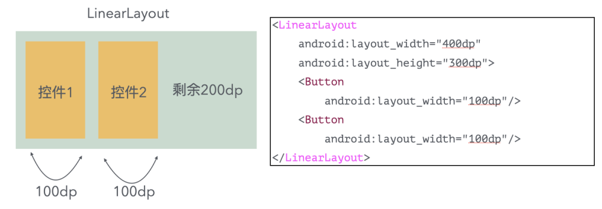
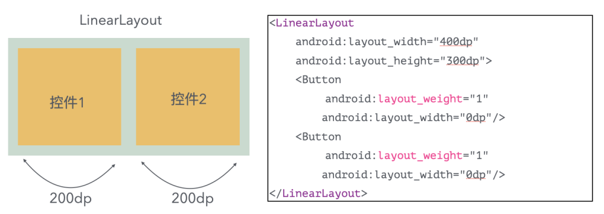
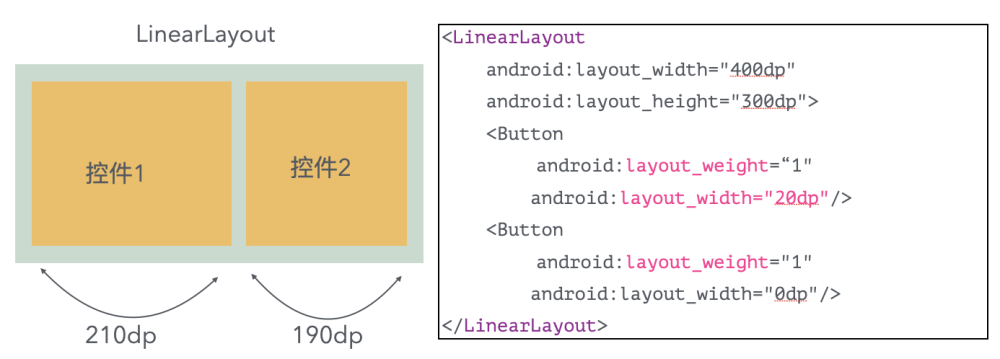
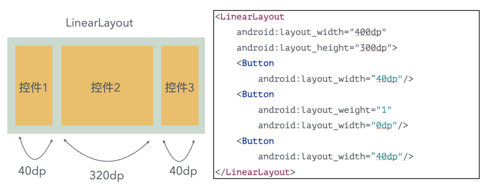
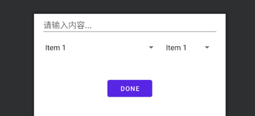

## 1.LinearLayout

`LinearLayout` 是一个线性布局，让内部子视图水平或垂直保持对齐，默认是水平。改变方向的属性是`android:orientation="vertical"`

> 注意：`ConstraintLayout`布局比`LinearLayout`有更好的性能和工具支持。

使用`LinearLayout`的基本代码如下：
```xml
<LinearLayout
    android:layout_width="match_parent"
    android:layout_height="match_parent"
    android:orientation="horizontal"  <!-- 水平布局 -->
    android:paddingHorizontal="20dp"  <!-- 可以让内容作业两端增加20dp -->
    android:layout_marginLeft="12dp">  <!-- 可以让布局左边距离父View增加20dp -->
    ....
</LinearLayout>
```

### 1.1 orientation属性

`LinearLayout`有水平和垂直两个布局方向，代码如下：
```java
android:orientation="horizontal"  // 水平
android:orientation="vertical"  // 垂直
```

### 1.2 layout_weight属性

`layout_weight`属性需要加到`LinearLayout`布局的子View中，作用是分配线性布局中剩余空间到该子子View。


👆🏻当只有`layout_width`时的情况，会自动按照子View指定的宽度排列。


👆🏻当有`layout_weight`时，会按照子View的`layout_weight`进行均分，上图两个子View就会按照`1:1`平分`LinearLayout`的`size`.
当然，如果第一个View是`layout_weight=1`，第二个View是`layout_weight=2`，此时就是`1:2`来分`LinearLayout`的大小.

> 注意，如图所示，当设置`layout_weight`时属性时，需要将子View的`layout_width`需要设置为`0dp`，同理，布局方向是`vertical`时，`layout_height`需要设置为`0dp`。


👆🏻`layout_weight`和`layout_width`可以同时设置值，代表`LinearLayout`减去子View的`layout_width`值之后，再去计算所有子View的`layout_weight`比例。


👆🏻也可以有的View只有`layout_width`，而有的View同时有`layout_weight`和`layout_width`。


### 1.3 gravity属性

`LinearLayout`布局的顺序默认是`从左往右`或`从上往下`排列。而`gravity`属性可以改变这个排列的对齐方式。


> `gravity`属性并不只是在`LinearLayout`布局才能使用，在其他布局中也同样能生效


### 1.4 元素间隔

要想让`LinearLayout`的每个子`View`之间都有一个固定宽度的间距，一般的做法是在每个`View`之间放一个固定宽度的`view`，然后设置`View`的宽度为`0`、`layout_weight`为`1`。这样虽能实现功能，但是当子View比较多的时候，就不方便了，下面是例如`android:divider`属性来实现间隔的一个方案：

1、首先新建一个固有的`width/height`的`Drawable`：

`spacer_medium.xml`代码：
```xml
<?xml version="1.0" encoding="utf-8"?>  
<shape xmlns:android="http://schemas.android.com/apk/res/android"  
    android:shape="rectangle">  

    <size android:width="@dimen/spacing_medium"  
        android:height="@dimen/spacing_medium" />  

    <solid android:color="@android:color/transparent" />  
</shape>
```

2.然后设置`LinearLayout`的`android:divider="@drawable/spacer_medium"`,和`android:showDividers="middle"`两个属性：
```xml
<LinearLayout   
       android:orientation="horizontal"  
       android:divider="@drawable/spacer_medium"  
       android:showDividers="middle">  

      <!-- 子View.... -->

   </LinearLayout>
```

## 2.RelativeLayout
`RelativeLayout`相对布局 :子视图可通过相应的布局属性，设定相对于另一个兄弟视图或父视图容器的相对位置。

属性说明：

> 注意下面有些已经有新API了，看警告替换即可，比如`layout_toLeftOf`替换为`layout_toStartOf`

**👇🏻相对于兄弟元素：**

| 属性名称 | 属性含义 |
| --- | --- |
| android:layout_below="@id/aaa" | 在指定View的下方 |
| android:layout_above="@id/aaa" | 在指定View的上方 |
| android:layout_toLeftOf="@id/aaa" | 在指定View的左边 |
| android:layout_toRightOf="@id/aaa" | 在指定View的右边 |
| android:layout_alignTop="@id/aaa" | 与指定View的上边界一致 |
| android:layout_alignBottom="@id/aaa" | 与指定View下边界一致 |
| android:layout_alignLeft="@id/aaa" | 与指定View的左边界一致 |
| android:layout_alignRight="@id/aaa" | 与指定View的右边界一致 |

**👇🏻相对于父元素：**

| 属性名称 | 属性含义 |
| --- | --- |
| android:layout_alignParentLeft="true" | 在父元素内左边 |
| android:layout_alignParentRight="true" | 在父元素内右边 |
| android:layout_alignParentTop="true" | 在父元素内顶部 |
| android:layout_alignParentBottom="true" | 在父元素内底部 |

**👇🏻对齐方式：**

| 属性名称 | 属性含义 |
| --- | --- |
| android:layout_centerInParent="true" | 居中布局 |
| android:layout_centerVertical="true" | 垂直居中布局 |
| android:layout_centerHorizontal="true" | 水平居中布局 |

**👇🏻间距：**

| 属性名称 | 属性含义 |
| --- | --- |
| android:layout_marginBottom="" | 离某元素底边缘的距离 |
| android:layout_marginLeft="" | 离某元素左边缘的距离 |
| android:layout_marginRight ="" | 离某元素右边缘的距离 |
| android:layout_marginTop="" | 离某元素上边缘的距离 |
| android:layout_paddingBottom="" | 往内部元素底边缘填充距离 |
| android:layout_paddingLeft="" | 往内部元素左边缘填充距离 |
| android:layout_paddingRight ="" | 往内部元素右边缘填充距离 |
| android:layout_paddingTop="" | 往内部元素右边缘填充距离 |

`RelativeLayout`代码示例：
```xml
<?xml version="1.0" encoding="utf-8"?>
<RelativeLayout xmlns:android="http://schemas.android.com/apk/res/android"
    android:layout_width="match_parent"
    android:layout_height="match_parent"
    android:paddingLeft="16dp"
    android:paddingRight="16dp" >
    <EditText
        android:id="@+id/name"
        android:layout_width="match_parent"
        android:layout_height="wrap_content"
        android:inputType="text"
        android:hint="请输入内容..." />
    <Spinner
        android:id="@id/times"
        android:layout_width="120dp"
        android:layout_height="50dp"
        android:layout_below="@id/name"
        android:layout_alignParentEnd="true" />
    <Spinner
        android:id="@+id/dates"
        android:layout_width="0dp"
        android:layout_height="50dp"
        android:layout_below="@id/name"
        android:layout_alignParentStart="true"
        android:layout_toStartOf="@+id/times" />

    <Button
        android:layout_width="96dp"
        android:layout_height="wrap_content"
        android:layout_below="@id/times"
        android:layout_centerInParent="true"
        android:layout_marginTop="40dp"
        android:text="done" />
</RelativeLayout>
```

效果如下：




## 3.FrameLayout
`FrameLayout`它允许在单个视图组中重叠放置子视图。`FrameLayout`会将所有子视图堆叠在同一个位置上，后添加的子视图会覆盖先前添加的子视图。

在XML中定义`FrameLayout`示例：
```xml
<FrameLayout xmlns:android="http://schemas.android.com/apk/res/android"
    android:layout_width="match_parent"
    android:layout_height="match_parent">
    <View
        android:layout_width="200dp"
        android:layout_height="200dp"
        android:background="#FF0000"/>
    <View
        android:layout_marginStart="20dp"
        android:layout_width="100dp"
        android:layout_height="100dp"
        android:background="#00FF00"/>
    <View
        android:layout_width="50dp"
        android:layout_height="50dp"
        android:layout_gravity="center"
        android:background="#0000FF"/>
</FrameLayout>
```

其中调整子视图的位置，可以使用`android:layout_gravity`来指定子视图的对齐方式，比如居中、靠左等。

## 4.GridLayout

网格布局`GridLayout`，可以搭建类似九宫格的效果，常用属性如下：

| 属性名称 | 属性含义 |
| --- | --- |
| android:columnCount | 列数 |
| android:rowCount | 行数 |
| android:layout_columnSpan | 横跨的列数 |
| android:layout_rowSpan | 横跨的行数 |


代码示例：
```xml
<GridLayout xmlns:android="http://schemas.android.com/apk/res/android"
    android:layout_width="wrap_content"
    android:layout_height="wrap_content"
    android:columnCount="4"
    android:rowCount="3">
    <TextView android:text="0"
        android:textSize="50sp"
        android:layout_columnSpan="4"
        android:layout_gravity="fill"
        android:background="#ffc"
        />
    <Button android:text="回退"
        android:layout_columnSpan="2"
        android:layout_gravity="fill"
        />
    <Button android:text="清空"
        android:layout_columnSpan="2"
        android:layout_gravity="fill"
        />
    <Button android:text="1" />
    <Button android:text="2" />
    <Button android:text="3" />
    <Button android:text="4" />
</GridLayout>
```

注意：`android:layout_columnSpan="4"`和`android:layout_gravity="fill"`同时使用代表，横跨4列，并且占据这4列，如果不加`android:layout_gravity="fill"`则只会占据对应的列数，但是不会填充。

> `GridLayout`想要均分子View，可以让子View添加`android:layout_columnWeight="1"`属性，这个示例是水平均分3个按钮：

```xml
<GridLayout
    android:paddingHorizontal="10dp"
    android:columnCount="5"  <!-- 这里是5列是因为有2个View充当了按钮的间距 -->
    android:layout_width="match_parent"
    android:layout_height="wrap_content">

    <Button android:layout_columnWeight="1"  <!-- 就是这个属性 -->
        android:layout_height="50dp" />

    <View android:layout_width="2dp" android:layout_height="match_parent" />

    <Button android:layout_columnWeight="1"
        android:layout_height="50dp" />

    <View android:layout_width="2dp" android:layout_height="match_parent" />

    <Button android:layout_columnWeight="1"
        android:layout_height="50dp" />
</GridLayout>
```


