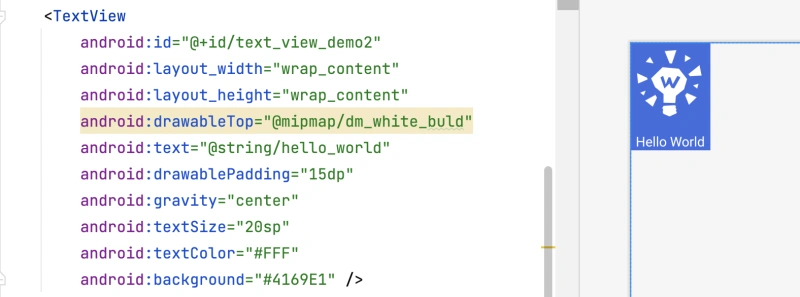
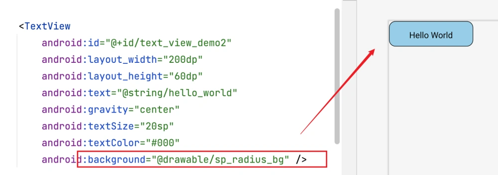

> 当前文件是`chapter04.md`

## 1.TextView

`TextView`用于显示文本的基础View，字体的尺寸单位为`sp`，常用属性如下：

> sp: `scaled pixels`(放大像素). 主要用于字体显示。

| 属性名称 | 属性含义 |
| --- | --- |
| android:id | 组件id，根据id，我们可以在Java代码中通过`findViewById()`的方法获取到该对象，然后进行相关属性的设置 |
| android:layout_width | 组件的宽度，自适应时为`wrap_content` |
| android:layout_height | 组件的高度，自适应时为`wrap_content` |
| android:textAlignment | 文本对齐方式（`viewEnd`、`center`...） |
| android:gravity | 设置控件中内容的对齐方向，`TextView`中是文字，`ImageView`中是图片等 |
| android:text | 显示的文本内容，一般我们是把字符串写到`values/string.xml`文件中，然后 通过`@String/xxx`取得对应的字符串内容 |
| android:textColor | 字体颜色，同上，可以直接颜色代码`#00FF00`，或通过`values/colors.xml`资源来引用 |
| android:textStyle | 字体风格，三个可选值:`normal`、`bold`、`italic` |
| android:textSize | 字体大小，单位一般是用`sp` |
| android:background | 控件的背景颜色，可以理解为填充整个控件的颜色，可以是图片、`shape` |
| android:autoLink | 识别链接类型 (web, email, phone ,map ,none, all) |
| android:maxLines | 最多显示几行，超过之后会自动截断 |
| android:ellipsize | 配合行数，当文本被截断时的效果，比如值为`end`就会结尾以`...`显示 |

代码示例：
```xml
<TextView
    android:id="@+id/text_view_demo"
    android:layout_width="wrap_content"
    android:layout_height="80dp"
    android:text="@string/hello_world"
    android:textSize="36sp"
    android:textColor="#000000"
    android:textStyle="bold"
    android:background="#E1FFFF"
    android:autoLink="all"/>
```

### 1.1 带图片(drawableXxx)的TextView

| 属性名称 | 属性含义 |
| --- | --- |
| android:drawableLeft | 文本左边设置图片 |
| android:drawableRight | 文本右边设置图片 |
| android:drawableBottom | 文本下边设置图片 |
| android:drawableTop | 文本上边设置图片 |

代码示例：




### 1.2 TextView自定义边框背景

原理：编写一个`ShapeDrawable`的资源文件!然后`TextView`将 `background` 设置为这个drawable 资源即可。
在`res/drawable`文件夹上，右键：`New` -> `Drawable Resource File`，代码内容如下：
```xml
<?xml version="1.0" encoding="utf-8"?>
<shape xmlns:android="http://schemas.android.com/apk/res/android">
    <!-- 设置背景色 -->
    <solid android:color="#87CEEB" />
    <!-- 设置一个黑色边框 -->
    <stroke
        android:width="1dp"
        android:color="#000000" />
    <!-- 设置四个圆角的半径 -->
    <corners
        android:bottomLeftRadius="15dp"
        android:bottomRightRadius="15dp"
        android:topLeftRadius="15dp"
        android:topRightRadius="15dp" />
    <!-- 设置一下边距,让空间大一点 -->
    <padding
        android:all="5dp"
        android:left="5dp"
        android:right="5dp"
        android:top="5dp" />
</shape>
```

将此`drawable`设置给`TextView`的`background`，效果如下：




## 2.EditText
`EditText`输入框，继承于`TextView`。常用属性如下：

| 属性名称 | 属性含义 |
| --- | --- |
| android:hint | 默认提示文本 |
| android:textColorHint | 默认提示文本的颜色 |
| android:selectAllOnFocus | 布尔值。输入框获得焦点后，是否选中输入框中所有的内容 |
| android:inputType | 对输入的数据进行限制，比如文本、数字 |
| android:minLines | 设置最小行数 |
| android:maxLines | 设置最大行数，当输入超过最大行数，会向上滚动 |
| android:singleLine | 只允许单行输入，而且不会滚动 |
| android:textScaleX | 设置字与字的水平间隔 |
| android:textScaleY | 设置字与字的垂直间隔 |

获取`EditText`输入的内容：
```java
editText.getText().toString().trim();
```

设置`EditText`的焦点：
```java
edit.requestFocus();  // 请求获取焦点
edit.clearFocus();  // 清除焦点
```

设置`EditText`光标位置的控制：
```java
// 一个参数的是设置光标位置的，两个参数的是设置起始位置与结束位置的中 间括的部分，即部分选中
edit.setSelection(2);
```

设置`EditText`弹出键盘：
```java
import android.content.Context;
import android.view.inputmethod.InputMethodManager;

EditText et = findViewById(R.id.number_view);
et.setFocusable(true);
et.requestFocus();  // 低版本这里就会弹出键盘了，高版本不可以

InputMethodManager imm = (InputMethodManager) getSystemService(Context.INPUT_METHOD_SERVICE);
if (imm != null) {
    imm.showSoftInput(et, InputMethodManager.SHOW_IMPLICIT);
}

// 关闭键盘则是：
et.clearFocus();  // 这里会闪退？？？
imm.hideSoftInputFromWindow(et.getWindowToken(), 0);
```

Java延迟执行代码：
```java
new Thread(new Runnable() {
    @Override
    public void run() {
        try {
            Thread.sleep(2000);  // 2秒
        } catch (InterruptedException e) {
            throw new RuntimeException(e);
        }

        // TODO...
    }
}).start();
```

## 3.Button
`Button`继承于`TextView`，拥有`TextView`的全部属性。
- `Button`有默认背景色，而`TextView`没有
- `Button`默认文本是居中，而`TextView`默认是居左对齐
- `Button`会自动将字母转为大写，关闭这个功能是`android:textAllCaps="false"`

其常用属性如下：

| 属性名称 | 属性含义 |
| --- | --- |
| android:textAllCaps | `Button`默认会将文本都转为大写显示，设置`false`可以关闭这个效果 |
| android:visibility | 按钮是否可见，`visible`:可见，占据屏幕区域；`invisible`: 不可见，但是占据布局位置；`gone`:不可见，也不占布局位置。


### 3.1 按钮状态

按钮的不同状态和样式，主要是通过在`res/drawable/`文件里面新建`selector`实现的，例如：
```xml
<?xml version="1.0" encoding="utf-8"?>
<selector xmlns:android="http://schemas.android.com/apk/res/android">
    <!-- 按下状态的颜色 -->
    <item android:drawable="@color/btn_test_pressed" android:state_pressed="true" />
    <!-- 正常状态的颜色，可以不写 android:state_pressed="false" -->
    <item android:drawable="@color/btn_test_normal" android:state_pressed="false" />
    <!-- 不可点击状态的颜色 -->
    <item android:drawable="@color/btn_test_disable" android:state_enabled="false" />
</selector>
```

在`Button`的引用方式是给`android:background`赋值。

实战例子：圆角+背景色： *(也可以是边框、渐变、虚线等按钮样式：)*

1.在`res/drawable/`文件夹新建`shape`，比如`btn_pressed.xml`:

```xml
<?xml version="1.0" encoding="utf-8"?>
<shape xmlns:android="http://schemas.android.com/apk/res/android">
    <!-- 圆角的半径 -->
    <corners android:radius="100dp"/>
    <!-- 填充颜色 -->
    <solid android:color="#0662f5"/>
</shape>
```

> 同理去创建其他的`shape`即可，比如`btn_normal.xml`

2.在`res/drawable/`文件夹新建`selector`，比如`btn_style.xml`:
```xml
<?xml version="1.0" encoding="utf-8"?>
<selector xmlns:android="http://schemas.android.com/apk/res/android">
    <!-- 引用刚刚创建的 shape -->
    <item android:drawable="@drawable/btn_pressed" android:state_pressed="true" />
    <item android:drawable="@drawable/btn_normal" android:state_pressed="false" />
</selector>
```

3.在`xml`中给`Button`使用即可：
```xml
<!-- 这里不是直接 <Button /> 是因为直接<Button会被系统接管样式而不起作用 >-->
<android.widget.Button
    android:background="@drawable/btn_color_test"
    android:text="我是按钮 jack" />
```

### 3.2 按钮点击

方案一是：`setOnClickListener`方法：

```java
Button oneBtn = findViewById(R.id.oneBtn);
// 注意这里是 View.OnClickListener 说明是定义在View里面的
oneBtn.setOnClickListener(new View.OnClickListener() {
    @Override
    public void onClick(View v) {
        // TODO....
    }
});
```

方案二，按钮比较多，当前`activity`实现`View.OnClickListener`接口：
```java
// 1.实现 OnClickListener
public class MainActivity extends AppCompatActivity implements View.OnClickListener {

    @Override
    protected void onCreate(Bundle savedInstanceState) {
        super.onCreate(savedInstanceState);
        setContentView(R.layout.activity_main);

        // 2.绑定 setOnClickListener
        Button oneBtn = findViewById(R.id.oneBtn);
        oneBtn.setOnClickListener(this);
    }

    @Override
    public void onClick(View v) {
        // TODO...
    }
}
```

方案三，引用方法：
```java
public void test() {
    // 绑定 setOnClickListener
    Button oneBtn = findViewById(R.id.oneBtn);
    oneBtn.setOnClickListener(this::onClick);
}

public void onClick(View v) {
    // TODO...
}
```

### 3.3 按钮类型？
```xml
<Button />
<android.widget.Button />
```
上面两种创建按钮的样式，使用代码打印其类型，结果如下：
```
<Button />：
com.google.android.material.button.MaterialButton

<android.widget.Button />：
android.widget.Button
```

## 4.ImageView

`ImageView`主要用来显示图片，但是它不只是能显示图片，任何`Drawable`对象都可以用它来显示。`ImageView`继承于`View`。

`scr`和`background`都可以设置`ImageView`的显示图片，但是二者的区别是：
- `background`通常是指的背景，而`scr`指的是内容
- `scr`设置图片时，需要配合`android:scaleType`等属性来调整图片显示效果，而`background`会根据`ImageView`的宽高进行拉伸。

Java代码中设置`scr`和`background`：
```java
setImageDrawable()  // 前景，对应 scr 属性
setBackgroundDrawable()  // 背景，对应 background 属性

// 另外，设置 scaleType 的方式如下：
android:scaleType="centerInside"  // XML中
imageView.setScaleType(ImageView.ScaleType.CENTER_INSIDE);  // 代码中
```

二者也可以结合使用：
```xml
<ImageView
     android:padding="20dp"
     android:layout_width="200dp"
     android:layout_height="200dp"
     android:scaleType="centerCrop"
     android:background="@drawable/shape_bg"
     android:src="@mipmap/pen" />
```

`android:scaleType`的值如下：

- `fitXY`:对图像的横向与纵向进行独立缩放,使得该图片完全适应`ImageView`,但是图片的横纵比可能会发生改变
- `fitStart`:保持纵横比缩放图片,直到较长的边与`Image`的边长相等,缩放完成后将图片放在`ImageView`的左上角
- `fitCenter`:同上,缩放后放于中间;
- `fitEnd`:同上,缩放后放于右下角;
- `center`:保持原图的大小，显示在`ImageView`的中心。当原图的`size`大于`ImageView`的`size`，超过部分裁剪处理。
- `centerCrop`:保持横纵比缩放图片,知道完全覆盖`ImageView`,可能会出现图片的显示不完全
- `centerInside`:保持横纵比缩放图片,直到`ImageView`能够完全地显示图片
- `matrix`:默认值，不改变原图的大小，从`ImageView`的左上角开始绘制原图，原图超过 `ImageView`的部分作裁剪处理


颜色
https://www.toolhelper.cn/Color/RGBToHex