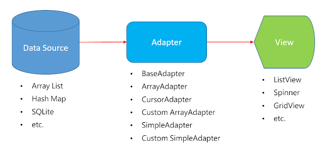

> 当前文件是`chapter06.md`

## 1.Date时间相关

### 1.1 Clock和计时器

`TextClock`和`AnalogClock`都动态显示当前的时间。`TextClock`继承于`TextView`，以格式化文本的方式动态显示时间；`AnalogClock`继承于`View`，以模拟表盘的方式显示当前时间。
```xml
<TextClock
    android:layout_width="wrap_content"
    android:layout_height="wrap_content"
    android:format24Hour="yyyy年MM月dd日 HH:mm:ss"/>

<AnalogClock
    android:layout_width="100dp"
    android:layout_height="100dp" />
```

`Chronometer`是计时器，继承于`TextView`，也可以倒计时，常用方法：
```java
// XML属性：
android:countDown  // 是否倒计时，默认false。
android:format // 设置显示时间格式。如果指定，第一个 "%s" 替换为"MM:SS"或"H:MM:SS"形式的当前计时器值。

// java方法：
「start()」：开始计时
「stop()」：停止计时
「setBase(long)」：设置计时器起始时间。
「setFormat(String)」：设置显示时间格式
「setOnChronometerTickListener(OnChronometerTickListener)」：为计时器绑定事件监听，当计时器改变时触发该监听器。
```

### 1.2 DatePicker

`DatePicker`日期选择器，父类是`FrameLayout`，用于选择年月日(星期)。

| `DatePicker`属性 | 属性含义 |
| --- | --- |
| android:firstDayOfWeek | 第一列为星期几，默认是星期日，比如2为星期一 |
| android:maxDate | 限制最大日期。"mm/dd/yyyy"格式 |
| android:minDate | 限制最小日期。"mm/dd/yyyy"格式 |
| android:datePickerMode | 显示模式：`spinner`或`calendar`，默认是`calendar` |
| android:spinnersShown | 当模式是`spinner`，是否显示左侧的日期滑动选择区域 |

```xml
<DatePicker
    android:firstDayOfWeek="2"
    android:layout_width="wrap_content"
    android:layout_height="wrap_content" />
```

> 注意：`DatePicker`获取的月份是从0到11

基本使用代码：
```java
DatePicker datePicker = findViewById(R.id.mydatepick);
datePicker.init(2000, 0, 1, null);  // 初始为2000年1月1日

// 设置日期改变的监听
datePicker.setOnDateChangedListener((view, year, monthOfYear, dayOfMonth) -> {
    // TODO
});

// 跟上面一样，只不过上面是 lamdba 表达式
datePicker.setOnDateChangedListener(new DatePicker.OnDateChangedListener() {
    @Override
    public void onDateChanged(DatePicker view, int year, int monthOfYear, int dayOfMonth) {
        // TODO
    }
});

datePicker.getYear()  // 获取当前选择的年份
datePicker.getMonth()  // 获取当前选择的月份（注意+1才是正常的，它是0到11的）
datePicker.getDayOfMonth()  // 获取当前选择的日
```

获取日历时间的代码：
```java
// 比如设置为北京时区
Calendar calendar = Calendar.getInstance(TimeZone.getTimeZone("GMT+8")); 
int yyyy = calendar.get(Calendar.YEAR);
int mm = calendar.get(Calendar.MONTH);  // 注意获取的月份是0到11
int dd = calendar.get(Calendar.DAY_OF_MONTH);

SimpleDateFormat sdf = new SimpleDateFormat("yyyy-MM-dd", Locale.getDefault());
String formattedDate = sdf.format(calendar.getTime());
```

### 1.3 TimePicker

`TimePicker`时间选择器，父类是`FrameLayout`，用于选择小时分钟。

- 属性`android:timePickerMode`设置显示风格，2种效果：`spinner`和`clock`。

### 1.4 CalendarView
`CalendarView`日历选择器，父类是`FrameLayout`，用于选择年月日。跟`DatePicker`用法差不多。


## 2.Adapter适配器

MVC模式：
- M: modle，数据源
- V: view，显示视图的控件，AdapterView（`ListView`、`GridView`、`Spinner`、`RecyleView`...）
- C: controller，控制器，adapter（`BaseAdapter`...）

在安卓中Data、Adapter、View 三者的关系是：


`Adapter`对象充当 `AdapterView` 和该视图的底层数据之间的桥梁。`Adapter` 提供对数据项的访问。`Adapter `还负责为数据集中的每个项目创建视图`View`。

`Adapter`的继承关系(部分)：


`adapterView`的继承关系(部分)：


## 3.ListView

`ListView`是垂直滚动列表，`ListView`的继承关系是：

`ListView` -> `AbsListView`(虚拟类) -> `AdapterView<android.widget.ListAdapter>` -> `ViewGroup` -> `View`。

### 3.1 ListView基本使用

①：在布局中定义`ListView`，并赋值`id`属性：
```xml
<ListView
    android:id="@+id/list_view"
    android:layout_width="match_parent"
    android:layout_height="match_parent" />
```

②：定义数据源，这里假设数据源为`MyModel`类：
```java
public class MyModel {
    String title;
    String message;
    String icon;
}
```

③：定义适配器`Adapter`；`Adapter`继承于`BaseAdapter`，并实现几个核心方法：
```java
public class MyAdapter extends BaseAdapter {
    List<MyModel> dataArray;
    Context mContext;

    public MyAdapter(List<MyModel> dataArray, Context mContext) {
        this.dataArray = dataArray;
        this.mContext = mContext;
    }

    @Override
    public int getCount() {  // 返回一共多少数据
        if (dataArray == null) {
            return 0;
        }
        return dataArray.size();
    }

    @Override
    public Object getItem(int position) {  // 返回对应索引的数据
        return dataArray.get(position);
    }

    @Override
    public long getItemId(int position) {
        return position;
    }

    @Override
    public View getView(int position, View convertView, ViewGroup parent) {
        // 检查 convertView 是否有复用对象
        if (convertView == null) {
            convertView = LayoutInflater.from(mContext).inflate(R.layout.list_cell, parent, false);
        }
        MyModel item = (MyModel)getItem(position);
        
        TextView titleView = HViewHolder.get(convertView, R.id.title_view);
        titleView.setText(item.title);

        TextView msgView = HViewHolder.get(convertView, R.id.msg_view);
        msgView.setText(item.message);

        ImageView imgView = HViewHolder.get(convertView, R.id.img_view);
        imgView.setImageResource(R.drawable.three_dog);

        return convertView;
    }
}
```

所以`BaseAdapter`的最基本的几个方法是:
- `getCount`  填充的数据集数
- `getItem`  数据集中指定索引对应的数据项
- `getItemId`  指定行所对应的ID
- `getView` 每个Item所显示的类容View


④：将适配器和`ListView`关联起来：
```java
protected void onCreate(Bundle savedInstanceState) {
    super.onCreate(savedInstanceState);

    mContext = this;
    listView = findViewById(R.id.list_view);

    // array是 MyModel 的 List<MyModel> 数据源
    myAdapter = new MyAdapter(array, mContext);
    listView.setAdapter(myAdapter);

    // 设置 ListView 的点击事件
    listView.setOnItemClickListener(new AdapterView.OnItemClickListener() {
        @Override
        public void onItemClick(AdapterView<?> parent, View view, int position, long id) {
            // TODO...
        }
    });
}
```

⑤：关于优化代码`ViewHolder`的代码：
```java
public class HViewHolder {
    /**
     * 从view获取对应id的子View，目的是优化 findViewById
     * @param view 被查找的父View
     * @param id 被查找view的R.id.xxx
     * @return 查找的子view
     * @param <T> 泛型view
     */
    @SuppressWarnings("unchecked")
    public static <T extends View> T get(View view, int id) {
        // SparseArray 是一个Map<Int, View>数据类型的对象,虽然名字是Array，但是用法是map
        SparseArray<View> viewMap = (SparseArray<View>) view.getTag();
        if (viewMap == null) {
            viewMap = new SparseArray<>();  // 如果 viewMap 为空，就新建并 setTag()
            view.setTag(viewMap);
        }

        View childView = viewMap.get(id);
        if (childView == null) {
            childView = view.findViewById(id);
            viewMap.put(id, childView);   // 缓存到map，下次取就不用再 findViewById
        }
        return (T) childView;
    }
}
```

### 3.2 ListView多样式布局

主要是在适配器`Adapter`里面重写`getItemViewType()`方法对应`View`是哪个类别，以及`getViewTypeCount()`方法返回 总共多少个类别!然后再`getView`那里调用`getItemViewType`获得对应类别，再加载对应的`View`!

```java
public class MyAdapter extends BaseAdapter {
    
    @Override
    public int getViewTypeCount() {  // 总共有多少Item布局
        return 2;
    }

    @Override
    public int getItemViewType(int position) {  
        // 每个布局的类型标识，随便定义常量数值即可
        if (position == 0) { return 6666; }
        return 8888;
    }

    @Override
    public View getView2(int position, View convertView, ViewGroup parent) {
        int layout_type = getItemViewType(position);
        
        if (layout_type == 6666) {
            // 1.判断 convertView 2.viewHolder获取对应view 3.赋值 4.返回 convertView
        } else if (layout_type == 8888) {
            // 1.判断 convertView 2.viewHolder获取对应view 3.赋值 4.返回 convertView
        }
    }
}
```

## 4.GridView
`GridView`网格视图，可以搭建九宫格样式的UI，`GridView`的继承关系跟`ListView`一样。用法也一样。其几个注意点如下：
```css
android:columnWidth: 设置列的宽度
android:gravity: 组件对其方式
android:horizontalSpacing: 水平方向每个单元格的间距 android:verticalSpacing: 垂直方向每个单元格的间距
android:numColumns: 设置列数
android:stretchMode: 设置拉伸模式，可选值如下: 
    none:不拉伸;
    spacingWidth:拉伸元素间的间隔空隙 
    columnWidth:仅仅拉伸表格元素自身 
    spacingWidthUniform:既拉元素间距又拉伸 他们之间的间隔空袭
```

## 5.Spinner

`Spinner`下拉选择器，它的继承关系是：`Spinner` -> `AbsSpinner` -> `AdapterView` -> `ViewGroup` -> `View`；所以它也具有适配器模式。

> 参考：https://zhuanlan.zhihu.com/p/448561541

### 5.1 Spinner用法一
直接在`res/values/string.xml`中定义数据源的方式（当然也可以动态）：
```xml
<resources>
    <string-array name="spinner_fruit">
        <item>香蕉</item>
        <item>苹果</item>
        <item>西瓜</item>
    </string-array>
</resources>
```

然后在布局中使用即可：
```xml
<Spinner
    android:id="@+id/choose_fruit_spinner"
    android:prompt="@string/spinner_a_tips"
    android:entries="@array/spinner_fruit"
    android:spinnerMode="dropdown"
    android:layout_width="200dp"
    android:layout_height="48dp" />
```

| 属性 | 属性含义 |
| --- | --- |
| android:dropDownHorizontalOffset | 设置列表框的水平偏移距离 |
| android:dropDownVerticalOffset | 设置列表框的水平竖直距离 |
| android:dropDownSelector | 列表框被选中时的背景 |
| android:popupBackground | 设置列表框的背景 |
| android:dropDownWidth | 设置下拉列表框的宽度 |
| android:entries | 使用数组资源设置下拉列表框的数据源 |
| android:prompt | 设置对话框模式的列表框的提示信息(标题)，只能够引用`string.xml` 中的资源`id`,而不能直接写字符串 |
| android:spinnerMode | 列表框的模式，有两个可选值: dialog:对话框风格的窗口 dropdown: 下拉菜单风格的窗口(默认) |

### 5.2 Spinner适配器

像`ListView`那样使用适配自定义数据源和下拉框的样式:
- 1.新建一个cell的layout，注意最外层应该是`android:layout_height="wrap_content"`
- 2.新建`MySpinnerApdapter`继承于`BaseAdapter`，实现相关方法
- 3.将`MySpinnerApdapter`设置给`Spinner`即可


```java
Spinner spinner_f = findViewById(R.id.choose_fruit_spinner);
// Spinner的选中方法
spinner_f.setOnItemSelectedListener(new AdapterView.OnItemSelectedListener() {
    @Override
    public void onItemSelected(AdapterView<?> parent, View view, int position, long id) {
        // TODO...
    }

    @Override
    public void onNothingSelected(AdapterView<?> parent) {
        // TODO...
    }
});
```


颜色
https://www.toolhelper.cn/Color/RGBToHex