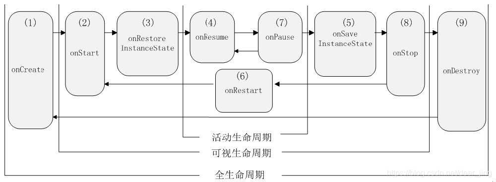
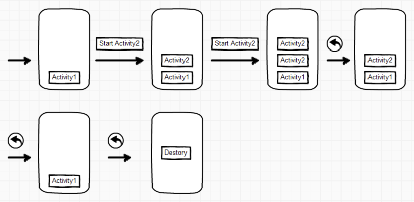
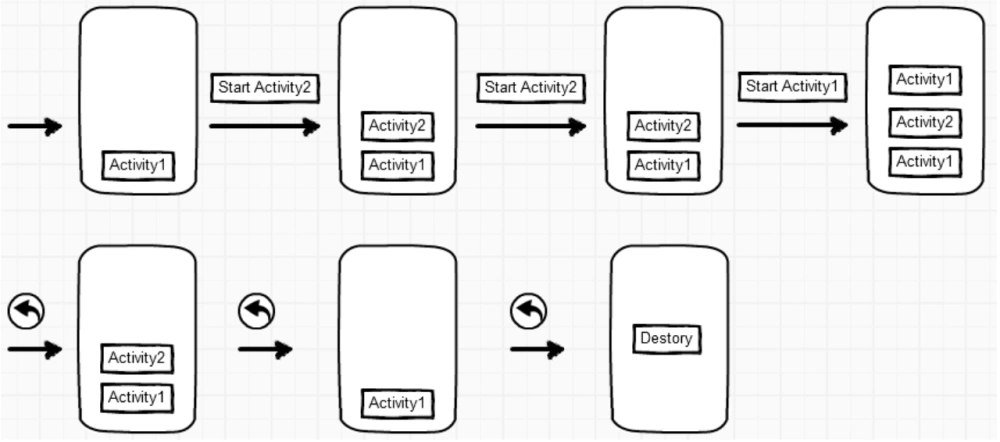
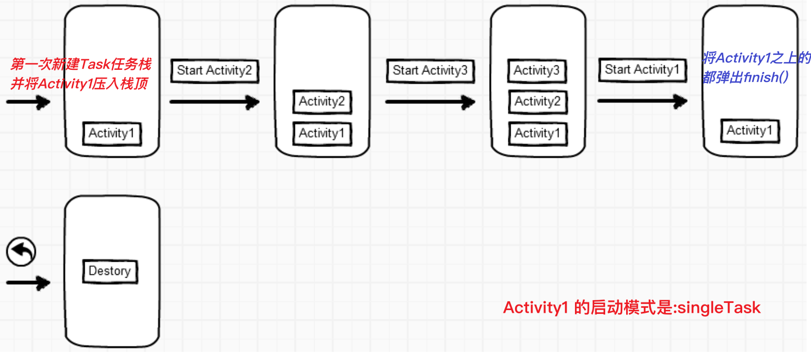
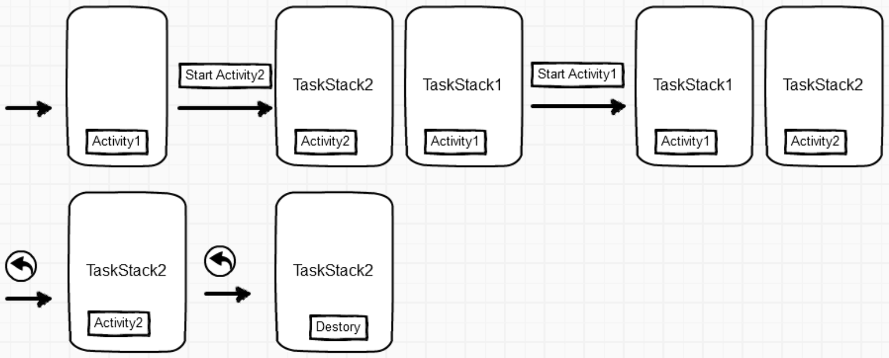

## 1.1 Activity简介
`Activity`可以理解为一个绘制UI的窗口，允许用户在上面进行交互，比如打电话页面、拍照页面等，这个窗口可以填满整个屏幕，也可能比屏幕小或者悬浮在其他窗口的上方。

通常，App会指定一个 `Activity` 为主 `Activity`，这是用户启动应用时出现的第一个屏幕。然后，每个 `Activity` 可以启动其他的 `Activity`，以执行不同的操作，从而形成了页面栈，当前活动的`Activity`位于栈顶。

> 继承`Activity`和`AppCompatActivity`区别：`AppCompatActivity`兼容了很多低版本的一些东西，`AppcompaActivity`相对于`Activity`的变化:主界面带有`toolbar`的标题栏;

```java
// 知晓当前是哪个Activity
Log.e("hou", "onCreate: " + getClass().getSimpleName());

```

## 1.2 Activity使用流程

**①：** 自定义`Activity`使类名，继承`Activity`类或它的子类(比如`AppCompatActivity`)
```java
class MyActivity extends Activity {}
```

**②：** 重写`onCreate()`方法，在该方法中调用`setContentView()`设置要显示的视图
```java
@Override
protected void onCreate(Bundle savedInstanceState) {
    super.onCreate(savedInstanceState);
    setContentView(R.layout.my_activity);
}
```

**③：** 在`AndroidManifest.xml`中对`Activity`进行配置：
```xml
<activity
    android:name="com.xx.MyActivity"
    android:label="Activity显示的标题"
    android:icon="图标"
    android:theme="要应用的主题"
    android:exported="false">
    <intent-filter>
        <action android:name="com.xx.MyActivity"/>
        <category android:name="android.intent.category.DEFAULT"/>
    </intent-filter>
```

**④：** 启动Activity：`startActivity(x)`

**⑤：** 关闭Activity：`finish()`


创建和启动`Activity`， **有2种方式：**

**1.显式启动 😄** ：
```java
// 1.最常见
Intent in = new Intent(this, MyActivity.class);
startActivity(in);

// 2.通过 ComponentName
ComponentName cn = new ComponentName("com.xx.pkg", "com.xx.cls");
Intent in = new Intent();
in.setComponent(cn);
startActivity(in);

// 上面的2个参数可以通过这么确认，第一个是全包名，第二个全类名
ComponentName cm = getComponentName();  // 在 Activity 中
String packageName = cm.getPackageName();
String className = cm.getClassName();

// 3.通过 setClassName()
Intent in = new Intent();
in.setClassName("com.xx.pkg", "com.xx.cls");  // 参数也可以通过上面的方式查看
startActivity(in);
```

**2.隐式启动 😄** ：
```java
// 参数是 AndroidManifest.xml 中配置的 activity >> intent-filter >> action
Intent in = new Intent("com.example.core.SecondActivity");
startActivity(in);
```

很多启动别的App都是使用隐式启动的方式，例如打开浏览器：
```java
Intent intent = new Intent(Intent.ACTION_VIEW);
intent.setData(Uri.parse("http://www.baidu.com"));
startActivity(intent);

// 或者 简写
Uri uri = Uri.parse("http://www.baidu.com");
Intent intent  = new Intent(Intent.ACTION_VIEW, uri);
startActivity(intent);
```

## 1.3 Activity生命周期


注意事项：
> 1. `onPause()`和`onStop()`被调用的前提是： 打开了一个新的Activity！而前者是旧Activity还可见的状态；后者是旧Activity已经不可见！
> 2. 另外，亲测：`AlertDialog`和`PopWindow`是不会触发上述两个回调方法的~
> 3. 官方：https://developer.android.google.cn/guide/components/activities/activity-lifecycle


**🌹横竖屏切换🌹**

在App进行横竖屏切换 或 多窗口模式时，`Activity`都会重新创建，如在播放视频时，应该在`onStop()`方法中进行处理暂停逻辑，在`onStart()`方法恢复视频的播放。

在`AndroidMainfest.xml`中的`<Activity>`标签加入`configChanges`属性可以禁止`Activity`重新创建：
```xml
<activity
    android:name="com.example.core.MyActivity"
    android:configChanges="orientation|keyboardHidden|screenSize|screenLayout">
    <intent-filter> ... </intent-filter>
</activity>
```

如果禁用横竖屏切换，可在`AndroidMainfest.xml`中的`<Activity>`标签加入`android:screenOrientation`指定横竖屏模式:
```xml
<activity
    android:name="com.example.core.MyActivity"
    android:screenOrientation="portrait">
    <intent-filter> ... </intent-filter>
</activity>
```

## 1.4 Activity保存状态

当在页面输入一行数据，然后启动OtherActivity，此时页面处于`onStop()`状态，若因系统内存不足被回收，当点击Back键返回时，页面会被重新创建，但是刚刚输入的内容却不见了。

通过`onSaveInstanceState(Bundle)`来解决这个问题，`onSaveInstanceState()`会在`onStop()`之前调用，在此方法里面临时保存数据。

```java
@Override
protected void onSaveInstanceState(@NonNull Bundle outState) {
    super.onSaveInstanceState(outState);
    outState.putString("tempData", "我是数据");
}
```

恢复数据，可在`onCreate()`方法中：

```java
@Override
protected void onCreate(Bundle savedInstanceState) {
    super.onCreate(savedInstanceState);
    setContentView(R.layout.activity_second);

    if (savedInstanceState != null) {
        String text = savedInstanceState.getString("tempData");
    }
}
```

`onSaveInstanceState()`方法的执行时机是：`onStop()` -> `onSaveInstanceState()` -> `onDestroy()` *(不一定会走到销毁方法，看情况)* 。`onSaveInstanceState()`执行的条件：
- 1.点击home键回到主页
- 2.点击任务键选择运行其他App
- 3.从Activity中启动一个新的Activity
- 4.按下电源键关闭屏幕(执行`onRestoreInstance`)
- 5.横竖屏切换(执行`onRestoreInstance`)

> 注意：当用户显式关闭 `activity` 或其他情况下，当调用 `finish()` 时，系统不会调用 `onSaveInstanceState()`。

**Activity事件回调函数的调用顺序：**



## 1.5 Activity传参

`A_Activity`给`B_Activity`传递参数：
```java
// Intent 携带参数
Intent in = new Intent(this, SecondActivity.class);
in.putExtra("name", "侯万");
in.putExtra("age", 18);
startActivity(in);

// 进入SecondActivity后，从Intent获取携带的参数
@Override
protected void onCreate(Bundle savedInstanceState) {
    super.onCreate(savedInstanceState);
    setContentView(R.layout.activity_second);

    Intent in = getIntent();  // 检查当前携带的参数
    String nameStr = in.getStringExtra("name");
    Integer age = in.getIntExtra("age", 0);
}
```

## 1.6 Activity回参

**①：** 老的方式：
```java
final int REQUEST_CODE = 1002;

// 调用 startActivityForResult() 跳转Activity，并等待回参数
Intent in = new Intent(this, SecondActivity.class);
startActivityForResult(in, REQUEST_CODE);  // REQUEST_CODE 只是标识符号

// 在Activity的 onActivityResult() 方法中拿回传的参数
@Override
protected void onActivityResult(int requestCode, int resultCode, @Nullable Intent data) {
    super.onActivityResult(requestCode, resultCode, data);

    if (requestCode == REQUEST_CODE && resultCode == RESULT_OK) {
        data.getStringExtra("res");  // 获取回传的参数
    }
}
```

在第二个`Activity`中设置回传的参数：
```java
Intent backIn = new Intent();
backIn.putExtra("res", "回传数据");
setResult(RESULT_OK, backIn);   // 赋值回传的数据

finish();  // 关闭当前 Activity
```

> 注意：如果有回传的数据，那么`onActivityResult()`方法会在`onStart()`之后调用。

**②：** 新的API：

在新的API中使用`ActivityResultLauncher`监听回传的参数，回传的方法跟上面一样。
```java
// 1.在Activity中，使用registerForActivityResult()方法注册一个ActivityResultLauncher。
import androidx.activity.result.ActivityResult;
import androidx.activity.result.ActivityResultCallback;
import androidx.activity.result.ActivityResultLauncher;
import androidx.activity.result.contract.ActivityResultContracts;

public class MainActivity extends AppCompatActivity {
    // 将 resultLauncher 定义为了属性
    private ActivityResultLauncher<Intent> someActivityResultLauncher = registerForActivityResult(
        new ActivityResultContracts.StartActivityForResult(),
        new ActivityResultCallback<ActivityResult>() {
            @Override
            public void onActivityResult(ActivityResult result) {
                if (result.getResultCode() == RESULT_OK) {
                    // 处理返回的数据
                    Intent data = result.getData();
                    // 更新UI或其他操作
                }
            }
        }
    );

    private void test() {
        Intent intent = new Intent(this, AnotherActivity.class);
        someActivityResultLauncher.launch(intent);  // 跳转其他Activity方式
    }
}
```

## 1.7 Activity任务栈

这是Android中`Activity`的管理机制，一般App都由多个`Activity`构成，而Android使用`Task`的概念，管理`Activity`之间的跳转与返回。在`Task`的实现层面的数据结构则是`Back Stack`回退堆栈。

跟栈一样，具有下面的特点：
> 后进先出(LIFO)，常用操作入栈(push)，出栈(pop)，处于最顶部的叫栈顶，最底部叫栈底

官方文档的一个流程图：


> Task是Activity的集合，是一个概念，实际使用的Back Stack来存储Activity，可以有多个Task，但是 同一时刻只有一个栈在最前面，其他的都在后台！

## 1.8 Activity启动模式

可以在`AndroidManifest.xml`中的 `<activity>` 元素的 `launchMode` 属性指定 activity 的启动模式，一共5种模式：
- 1.`"standard"`  *默认启动模式*
- 2.`"singleTop"`  *栈顶复用*
- 3.`"singleTask"`  *栈内复用*
- 4.`"singleInstance"`  *全局唯一，单实例模式*
- 5.`"singleInstancePerTask"`  *大屏幕上构建并排功能的一种优化模式*

> 参考总结：https://www.jianshu.com/p/356ed86c652b

> 官方 https://developer.android.google.cn/guide/components/activities/tasks-and-back-stack

> 知乎 https://zhuanlan.zhihu.com/p/505768791

### 1.8.1 standard模式

标准启动模式，也是`Activity`的默认启动模式，在这种模式下启动的`Activity`可以被多次实例化，即在同一个`Task`任务栈中可以存在多个`Activity`的实例，每个实例都会处理一个`Intent`对象。

<p align="center">
  
</p>

### 1.8.2 singleTop模式

如果一个以`singleTop`模式启动的`Activity`的实例已经存在于`Task`任务栈的栈顶， 那么再启动这个`Activity`时，**不会创建新的实例**，而是重用位于栈顶的那个实例，并且会调用该实例的`onNewIntent()`方法将`Intent`对象传递到这个实例中。 

如果以`singleTop`模式启动的`activity`的一个实例 已经存在与`Task`任务栈中，**但是不在栈顶**，那么它的行为和`standard`模式相同，也会创建多个实例。

<p align="center">
  
</p>

`singleTop`启动模式可以避免同个页面嵌套地狱，比如A->B->A->B...等，这样不会重新创建页面，只会回调当前页面的 `onPause` ->`onNewIntent` 传递新的 `Intent` -> `onResume`。

> 🌹NOTE：只有当 `singleTop` 模式的 `Activity` 存在于栈顶时，`Activity` 的表现才与 `standard` 模式不同。

### 1.8.3 singleTask模式

如果要启动的`Activity`不存在，则会创建一个`Task`任务栈，并将`Activity`实例化压入栈顶。如果`Activity`存在，**并且位于`Task`任务栈的栈顶**，则直接复用这个`Activity`实例。如果已存在的这个`Activity`不是`Task`任务栈的栈顶，则将这个`Activity`实例之上的所有`Activity`都弹出栈(`finish()`)。

复用此`Activity`则跟之前一样，系统会通过调用其 `onNewIntent()` 方法将 `intent` 转送到该实例。

<p align="center">
  
</p>

> `singleTask`模式应用场景：APP首页/主页，只要 `Activity` 在一个栈中存在，那么多次启动此 `Activity` 都不会重新创建实例，和 `singleTop` 一样，系统也会回调其 `onNewIntent()`方法；

### 1.8.4 singleInstance模式

如果启动的`Activity`不存在，则会为这个`Activity`分配一个新的`affinity`，并创建一个新的`Task`任务栈，并将这个`Activity`实例化放入这个`Task`任务栈。**这个`Task`任务栈有且只有这一个`Activity`实例**。

如果启动的`Activity`存在，则会它所在的`Task`任务栈移到前台(`Foreground`)，并将`Activity`唤醒复用显示出来：调用这个实例的`onNewIntent()`方法，将·实例传递到该实例中。保证无论从哪个`Task`任务栈启动`Activity`，都只会创建一个`Activity`实例。

<p align="center">
  
</p>

**注意点：**
- 1）`singleTop`、`singleTask`、`singleInstance`这三种启动模式，都是在同一个栈中，`singleInstance`是属于自己独立的一个栈中；
- 2）`singleInstance`它是单一的一个对象，独占一个栈，不会再创建；
- 3）`singleInstance`是singleTask的加强模式，具有`singleTask`的全部特性。

> `singleInstance`的应用场景：APP首页/主页/呼叫来电界面

### 1.8.5 singleInstancePerTask模式

`singleInstancePerTask`模式是`Android12`之后新增的模式，在`Android12`以下的机型无效，是最适合作为 `MainActivity` 的启动模式。

`singleInstancePerTask`模式和`singleTask`模式的区别是：
- 1.`singleTask` 可以处在栈中的任意位置，而 `singleInstancePerTask` **只能处于栈底**。
- 2.`singleTask` 在 Android 中，只会有一个实例（`startActivity` 时，没有则创建，有则调起所在的`Task`栈，并回退到该 `activity`，同时回调 `onNewIntent `），而 `singleInstancePerTask` 可以搭配 `flag`，在多个栈中有不同实例（可以有两个栈同时以该 `Activity` 为栈底）
- 3.`singleInstancePerTask` 会在系统已存在没有该实例的同 `taskAffinity` 任务栈时，重新开启一个栈，而 `singleTask` 则会直接在该栈顶创建 `Activity`
- 4.`singleTask`和`singleInstancePerTask`复用`Activity`时，如果不在栈顶，则都会将此`Activity`之上的所有`Activity`移除`finish()`。直到`Activity`成为栈顶。

### 1.8.6 启动模式总结

| 模式 | 总结 |
| --- | --- |
| `standard` | 创建并在堆栈栈顶加入 Activity |
| `singleTop` | ①基本与 `standard` 一致 <br>②除非是在栈顶再次启动 — 直接回调 activity 的 `onPause()` - `onNewInstent()` - `onResume()` |
| `singleTask` | 1.切换到对应 `taskAffinity` 中显示。<br>2.如果不存在 `taskAffinity` 一致的 task，创建 task，创建 Activity，入栈；<br>3.如果已存在，将对应 Task 提到前台；<br>4.如果已存在的 Task 内，已存在该 Activity，将 Task 回退到该 Activity 位置，并回调 Activity 的 `onNewIntent()` |
| `singleInstancePerTask` | ①切换到对应 `taskAffinity` 中显示。<br>②如果不存在 `taskAffinity` 一致的 task，创建 task，创建 Activity，入栈；<br>③如果已存在，且该 Activity 即为栈底 Activity，将对应 task 提到前台，且清空栈顶所有 Activity，回调 `onNewIntent`，并显示；<br>④如果已存在 `taskAffinity` 一致的 task，且 task 中没有该 activity，创建一个同 `taskAffinity` 的任务栈，创建 Activity，入栈。（4.1 原本被隐藏的 task，会在返回时重新提回前台；4.2 又或是在点击home 键回到桌面被销毁） |
| `singleInstance` | A.切换到对应 `taskAffinity` 中显示。<br>B.且 Task 内只会有这一个 Activity<br>C.如果已存在该 Activity 的单独任务栈，调起任务栈，回调 `onNewIntent`，并显示；<br>D.若存在同名任务栈，非该 Activity 单独任务栈，创建新的任务栈，并置于前台，原本任务栈隐藏 |


- 多个同 `taskAffinity` 栈的处理
    - 在任务管理器中，只会显示最近出现在前台的一个，其他的全部被隐藏
    - 只有 `singleInstance` 和 `singleInstancePerTask` 在已存在同 `taskAffinity` 任务栈的情况下，会开启新的任务栈，并将原本任务栈隐藏；
    - 回到桌面后，隐藏栈自动被销毁 （Android 12）

- 点击桌面图标启动 Activity
    - 不存在栈，创建栈，创建 `launchActivity`，入栈，显示
    - 存在栈，且 `LaunchActivity` 为 `standard`，调起任务栈
    - 存在栈， LaunchActivity 为 `singleTop`，且当前页面为 LaunchActivity，回调 `onNewIntent`
    - 存在栈， LaunchActivity 为其他需要切换栈的 `launchMode`，在任务栈顶启动 LaunchActivity
    - Android 12，存在栈，且栈底为 `singleInstancePerTask`，调起任务栈
- Android 12 中，任务栈切换 task，不会销毁原本任务记录，切换到桌面才会


## 1.9 taskAffinity
`taskAffinity` 表示 `Activity` 倾向于属于哪个任务。`taskAffinity` 属性采用字符串值，该值必须不同于 `AndroidManifest.xml` 中声明的默认软件包名称，因为系统使用该名称来标识应用的默认任务亲和性。`taskAffinity` 实际上就是用来给 `Activity` 指定任务的标签。但是需要配合特殊场景使用。

- 当启动 `Activity` 的 `intent` 包含 `FLAG_ACTIVITY_NEW_TASK` 标记时
  - 如果传递给 startActivity() 的 intent 包含 FLAG_ACTIVITY_NEW_TASK 标记，则系统会寻找其他任务来容纳新 Activity。通常会是一个新任务，但也可能不是。如果已存在与新 Activity 具有相同 taskAffinity 的现有任务，则会将 Activity 启动到该任务中。如果不存在，则会启动一个新任务。

- 当 `Activity` 的 `allowTaskReparenting` 属性设为 `"true"` 时
  - 在这种情况下，一旦和 `Activity` 有相同 `taskAffinity` 的任务进入前台运行，`Activity` 就可从其启动的任务转移到该任务。

> 如果一个 APK 文件中包含了就用户角度而言的多个“App应用”，（一个 App 安装后会在 `launcher` 中存在多个图标）您可能需要使用 `taskAffinity` 属性为每个“应用”所关联的 `Activity` 指定不同的亲和性。


颜色
https://www.toolhelper.cn/Color/RGBToHex