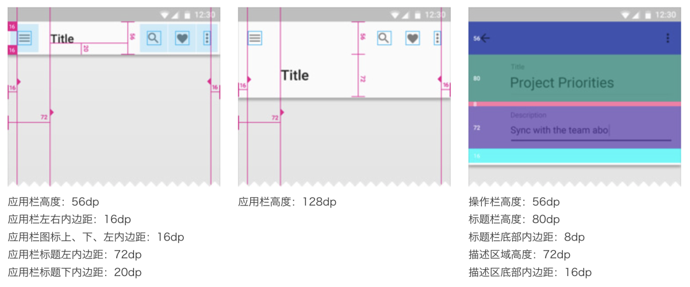

> 当前文件是`chapter100.md`

## 1.Android程序启动图标

### 1.1 图标icons：

| 用途 | mdpi (160dpi) | hdpi (240dpi) | xhdpi (320dpi) | xxhdpi (480dpi) | xxxhdpi (640dpi) |
| --- | --- | --- | --- | --- | --- |
| 应用图标 | 48 x 48 px | 72 x 72 px | 96 x 96 px | 144 x 144 px | 192 x 192 px |
| 系统图标 | 24 x 24 px | 36 x 36 px | 48 x 48 px | 72 x 72 px | 196 x 196 px |

### 1.2 单位和度量 Units and measurements

- `dpi` = 屏幕宽度（或高度）像素 / 屏幕宽度（或高度）英寸
- `dp` = (宽度像素 x 160) / `dpi`

| 名称 | 分辨率px | dpi | 像素比(density) | 示例dp | 对应像素 |
| --- | --- | --- | --- | --- | --- |
| xxxhdpi | 2160 x 3840 | 640 | 4.0 | 48dp | 192px |
| xxhdpi | 1080 x 1920 | 480 | 3.0 | 48dp | 144px |
| xhdpi | 720 x 1280 | 320 | 2.0 | 48dp | 96px |
| hdpi | 480 x 800 | 240 | 1.5 | 48dp | 72px |
| mdpi | 320 x 480 | 160 | 1.0 | 48dp | 48px |

### 1.3 应用栏 App bar



来源：
https://www.25xt.com/screen/android.html


## 2.Android样式

Android的样式一般定义在`res/values/styles.xml`文件中 *（新版本是`themes.xml`）*，其中有一个根元素`<resource>`，而具体的每种样式定义则是通过`<resource>`下的子标签`<style>`来完成，`<style>`通过添加多个`<item>`来设置样式不同的属性。另外，样式是可以继承的，可通过`<style>`标签的`parent`属性声明要继承的样式，也可通过点前缀` (.) `继承，点前面为父样式名称，后面为子样式名称。
```xml
<resources xmlns:tools="http://schemas.android.com/tools">
    <!-- Base application theme. -->
    <style name="Theme.DemoAB" parent="Theme.MaterialComponents.DayNight.DarkActionBar">
        <!-- Primary brand color. -->
        <item name="colorPrimary">@color/purple_500</item>
        <item name="colorPrimaryVariant">@color/purple_700</item>
    </style>
</resources>
```

现在我想继承`Widget.AppCompat.Button`样式，改变背景和文字颜色，那么，代码如下：
```xml
<!-- res/values/styles.xml -->
<resources>
    <style name="ButtonNormal" parent="Widget.AppCompat.Button" >
       <item name="android:background">@drawable/bg_btn_selector</item>
       <item name="android:textColor">@color/text_btn_selector</item>
    </style>
</resources>
```

其中`@drawable/bg_btn_selector`和`@color/text_btn_selector`的实现是放在`res/drawable/`文件夹下面的`selector`，例如`bg_btn_selector.xml`内容如下：
```xml
<?xml version="1.0" encoding="utf-8"?>
<selector xmlns:android="http://schemas.android.com/apk/res/android">
    <!-- 可以指定为 drawable(shape) -->
    <item android:drawable="@drawable/btn_pressed1" android:state_pressed="true" />
    <!-- 可以指定为 color -->
    <item android:drawable="@color/btn_test_disable" android:state_enabled="false" />
</selector>
```

有些按钮，我只想改变文字颜色，但背景想让它透明，这时就可以用`点前缀`的方式继承以上的样式，代码如下：
```xml
<!-- res/values/styles.xml -->
<resources>
    <style name="ButtonNormal" parent="Widget.AppCompat.Button">
              <item name="android:background">@drawable/bg_btn_selector</item>
              <item name="android:textColor">@color/text_btn_selector</item>
     </style>
     <style name="ButtonNormal.Transparent">
                <item name="android:background">@drawable/bg_btn_transparent</item>
                <item name="android:textColor">@color/text_btn_selector</item>
     </style>
</resources>
```

引用的时候只要在相应的`Button`里添加`style`就可以了，代码如下：

```xml
<Button
    style="@style/ButtonNormal.Transparent" />
```

以上的简单例子只用于单个`View`，这是样式最简单的用法。但样式的用法不只是用于单个`View`，也能用于`Activity`或整个`Application`，这时候需要在相应的`<activity>`标签或`<application>`标签里设置`android:theme`属性，引用的其实也是`style**`，但一般称为主题。

Android系统提供了多套主题，查看Android的`frameworks/base/core/res/res/values`目录可以看到安卓本身的主题和样式。

- https://android.googlesource.com/platform/frameworks/base/+/refs/heads/master/core/res/res/values
- 项目`External Libraries/<Android API xxx>/res/`也能看到

不过在实际应用中，因为大部分都采用兼容包的，一般都会采用兼容包提供的一套主题：`Theme.AppCompat`。`AppCompat`主题默认会根据不同版本的系统自动匹配相应的主题，比如在Android 5.0系统，它会继承`Material`主题。

> 使用Android系统自带的Theme要加上`"android:"`,如：`android:Theme.Light`,使用兼容包的主题就不需要前缀了，直接：`Theme.AppCompat`。

常见系统自带的Theme：

- API 1:
    - 1.android:Theme 根主题
    - 2.android:Theme.Black 背景黑色
    - 3.android:Theme.Light 背景白色
    - 4.android:Theme.Wallpaper 以桌面墙纸为背景
    - 5.android:Theme.Translucent 透明背景
    - 6.android:Theme.Panel 平板风格
    - 7.android:Theme.Dialog 对话框风格
- API 11:
    - 1.android:Theme.Holo Holo根主题
    - 2.android:Theme.Holo.Black Holo黑主题
    - 3.android:T`heme.Holo.Light Holo白主题
- API 14:
    - 1.Theme.DeviceDefault 设备默认根主题
    - 2.Theme.DeviceDefault.Black 设备默认黑主题
    - 3.Theme.DeviceDefault.Light 设备默认白主题
- API 21: (也就是Android Material Design主题)
    - 1.Theme.Material Material根主题
    - 2.Theme.Material.Light Material白主题
- Theme.AppCompat 兼容主题
    - 1.Theme.AppCompat 兼容主题的根主题
    - 2.Theme.AppCompat.Black 兼容主题的黑色主题
    - 3.Theme.AppCompat.Light 兼容主题的白色主题


自定义主题也很简单，只要继承某一父主题，然后在`<activity>`标签或`<application>`中引用就可以了。主题的定义示例如下：
```xml
<resources>
      <style name="AppTheme" parent="Theme.AppCompat">
          <item name="windowActionBar">false</item>
          <item name="windowNoTitle">true</item>
          <item name="windowAnimationStyle">@style/WindowAnimation</item>
      </style>
      <!-- Standard animations for a full-screen window or activity. -->
      <style name="WindowAnimation" parent="@android:style/Animation.Activity">
          <item name="activityOpenEnterAnimation">@anim/activity_open_enter</item>
          <item name="activityOpenExitAnimation">@anim/activity_open_exit</item>
          <item name="activityCloseEnterAnimation">@anim/activity_close_enter</item>
          <item name="activityCloseExitAnimation">@anim/activity_close_exit</item>
      </style>
</resources>
```

其中，`WindowAnimation`重新指定了`Activity`的转场动画，以下为`activity_close_exit`的示例代码：
```xml
<?xml version="1.0" encoding="utf-8"?>
<set
      xmlns:android="http://schemas.android.com/apk/res/android"
      android:shareInterpolator="false"
      android:zAdjustment="top">
      <alpha
              android:fromAlpha="0.0"
              android:toAlpha="1.0"
              android:interpolator="@interpolator/decelerate_quart"
              android:fillEnabled="true"
              android:fillBefore="false"
              android:fillAfter="true"
              android:duration="200" />
       <translate
              android:fromYDelta="8%"
              android:toYDelta="0"
              android:fillEnabled="true"
              android:fillBefore="true"
              android:fillAfter="true"
              android:interpolator="@interpolator/decelerate_quint"
              android:duration="350" />
</set>
```

若要使用到整个`Application`，则在`AndroidManifest.xml`的`<application>`标签设置`android:theme`属性，示例代码如下：

```xml
<application
      android:theme="@style/AppTheme">
</application>
```

## 3.asset 目录和 res 目录
`asset` 目录和 `res` 目录 的区别是：
- 引用资源的方式不同：
    - `asset`访问时是通过`AssetManager`进行访问。
    - `res`中的文件都有一个唯一的资源`id`，通过`R.id.filename`进行访问。

- 处理方式不同：
    - `asset`文件夹下的文件都是原封不动的打入`apk`包中。
    - `res`除`raw`下的文件原封不动的打入`apk`包中，其他所有文件都会被编译成二进制文件。

- 子目录不同：
    - `asset`可以任意创建子目录
    - `res`只能有一层子目录，并且是预定义的，比如`res/layout`、`res/anim`、`res/xml`、`res/values`等。


