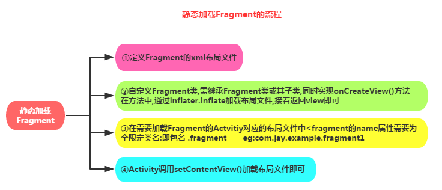
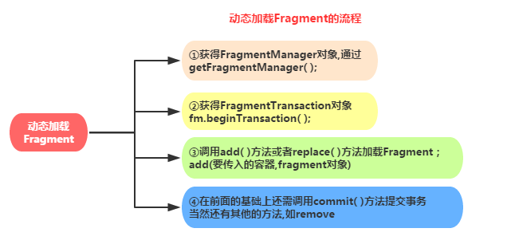

> 当前文件是`chapter12.md`

## 1.Fragment介绍

`Fragment`可以把他看成一个小型的`Activity`，又称`Activity`片段，`Fragment`并不能单独使用，他需要嵌套在`Activity`中使用，尽管他拥有自己的生命周期，但是还是会受到宿主`Activity`的生命周期的影响，比如`Activity`被destory销毁了，他也会跟着销毁！

`Fragment`的 **生命周期图：**


`Fragment`管理与`Fragment`事务：


`Fragment`与`Activity`的交互


## 2.Fragment使用
`Fragment`有两种加载方式：静态加载、动态加载。

### 2.1 静态加载Fragment


①:定义`Fragment`的布局，就是`fragment`显示的内容。

②:自定义一个`Fragment`类,需要继承`Fragment`或者他的子类,重写`onCreateView()`方法 
```java
public class MyFragment extends Fragment {
    @Override
    public View onCreateView(LayoutInflater inflater, ViewGroup container,
            Bundle savedInstanceState) {
        View view = inflater.inflate(R.layout.fragment1, container,false);
        return view;
    }   
}
```

③：在需要加载`Fragment`的`Activity`对应的布局文件中添加`fragment`的标签即可引用：
```xml
<!-- 注意：必须给一个id属性 -->
<!-- 注意：name属性是全限定类名 -->
<fragment
    android:id="@+id/my_fragment_top"
    android:name="com.demo.MyFragment"
    android:layout_width="match_parent"
    android:layout_height="300dp"/>
```

### 2.2 动态加载Fragment



①：自定义一个`Fragment`类,需要继承`Fragment`，这里面还写了传递方法的代码：
```java
public class MyFragment2 extends Fragment {

    public interface Callback {  // 定义接口，用于和外界传递数据
        void getResult(String result);
    }

    private Callback delegate;  // 回调

    int age;  // 测试外界直接使用 对象.成员 这么传参数

    @Nullable
    @Override
    public View onCreateView(@NonNull LayoutInflater inflater, @Nullable ViewGroup container, @Nullable Bundle savedInstanceState) {
        View tmpView = inflater.inflate(R.layout.myfragment_bom_layout, container, false);
        String args = getArguments().getString("name_age");  // 获取参数
        Log.d("hou", "onCreateView: " + args);  // 测试 getArguments() 传参数，这一般用于初始化View

        Button btn = tmpView.findViewById(R.id.fment_bom_btn);
        btn.setOnClickListener(v -> {  // 测试按钮点击之后，回调给 Activity
            Log.d("hou", "点击了按钮: " + age);
            delegate.getResult("我是给外界的数据");
        });

        return tmpView;
    }

    public void setCallback(Callback delegate) {  // 设置回调
        this.delegate = delegate;
    }
}
```

②：在`Activity`中动态添加代码：
```java
protected void onCreate(Bundle savedInstanceState) {
    super.onCreate(savedInstanceState);
    setContentView(R.layout.activity_my_fragment);

    MyFragment2 myFragment = new MyFragment2();
    myFragment.age = 18;  // 其实直接这么穿参数也可以
    Bundle b = new Bundle();
    b.putString("name_age", "hou_18");
    myFragment.setArguments(b);  // 也可以这么传递参数

    myFragment.setCallback(new MyFragment2.Callback() {  // 测试回调
        @Override
        public void getResult(String result) {
            Log.d("hou", "从 MyFragment2 向外界发送数据");
        }
    });

    FragmentManager fm = getSupportFragmentManager();
    FragmentTransaction ft = fm.beginTransaction();
    ft.add(R.id.fragment_content_view, myFragment);
    ft.commit();  // 提交事务，添加到页面上面
}
```
