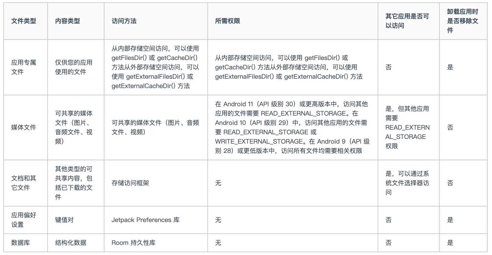

## 1.存储介绍
Android 使用的文件系统提供了如下几种保存应用数据的选项：

- **应用专属存储空间：** 存储仅供App使用的文件，可以存储到内部存储卷中的专属目录或外部存储空间中的其他专属目录。使用内部存储空间中的目录保存其他App不应访问的敏感信息。
- **共享存储：** 存储App打算与其他应用共享的文件，包括媒体、文档和其他文件。
- **偏好设置：** 以键值对形式存储私有原始数据。`DataStore` 提供了一种更现代的方式来存储本地数据。您应该使用 `DataStore` 而非 `SharedPreferences`。
- **数据库：** 使用 `Room` 持久性库将结构化数据存储在专用数据库中。

目录区别：



> 参考：https://www.cnblogs.com/joy99/p/17809113.html


应用内部私有存储：
- `/data/user/0/<包名>`
- `/data/user/0/<包名>/files`  # 存放文件数据
- `/data/user/0/<包名>/databases`  # 存放Sqlite的数据库文件
- `/data/user/0/<包名>/shared_prefs`  # 存放`SharedPreference`的数据
- `/data/user/0/<包名>/cache`  # 存放缓存文件

## 2.SharedPreferences
类似iOS的`UserDefaults`类
```java
// 为存储数据的文件名  MODE_PRIVATE: 只能我们的App能访问，并且会覆盖原来的对应的内容
// 例如文件名 AppData，😄切记这里**不要**加上文件后缀，例如 xx.xml，只需要名字即可。
SharedPreferences sp = getSharedPreferences("AppData", MODE_PRIVATE);
SharedPreferences.Editor editor = sp.edit();  // 用 SharedPreferences.Editor 这个内部类存写数据

// 存数据
editor.putString("app_name", "houwan");
editor.putInt("app_age", 20);
editor.apply();  // 提交保存数据

// 读数据
sp.getString("app_name", "null");
sp.getInt("app_age", 0);
```

> 存储的文件，可以从`Android Studio`的工具：`Device File Explorer` -> 对应模拟器 -> `data` -> `data` -> `对应包名` -> `shared_prefs`文件夹里面查看。

## 4.读写/files/目录文件
```java
public class FileHelper {
    private Context mContext;

    private FileHelper() {}

    public FileHelper(Context mContext) {
        super();
        this.mContext = mContext;
    }

    // 写文件，写入的内置的data/包名/files/目录中
    public void save(String filename, String filecontent) throws Exception {
        // 这里我们使用私有模式, 创建出来的文件只能被本应用访问, 还会覆盖原文件
        FileOutputStream output = mContext.openFileOutput(filename, Context.MODE_PRIVATE | Context.MODE_APPEND);
        output.write(filecontent.getBytes());  // 将String字符串以字节流的形式写入到输出流中
        output.close();  // 关闭输出流
    }

    // 文件读取
    public String read(String filename) throws IOException {
        //打开文件输入流
        FileInputStream input = mContext.openFileInput(filename);
        byte[] temp = new byte[1024];
        StringBuilder sb = new StringBuilder("");
        int len = 0;
        // 读取文件内容:
        while ((len = input.read(temp)) > 0) {
            sb.append(new String(temp, 0, len));
        }
        // 关闭输入流
        input.close();
        return sb.toString();
    }
}
```


## 3.读取res和assets
`raw`和`assets`两个目录的区别是：
- `res/raw`：文件会被映射到`R.java`文件中，访问的时候直接通过资源`ID`即可访问，而且Ta不能有目录结构，就是不能再创建文件夹。
- `assets`：不会映射到`R.java`文件中，通过`AssetManager`来访问，能有目录结构，即：可以自行创建文件夹。

```java
// 读取 res/raw 文件资源
InputStream is =getResources().openRawResource(R.raw.filename);

// 读取 assets 文件资源
AssetManager am =  getAssets();  
InputStream is = am.open("filename");
```

