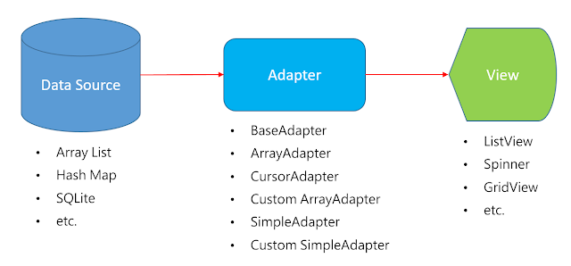

> 当前文件是`chapter15.md`


## 2.XXOO

### 1.1 Clock和计时器

`TextClock`和`AnalogClock`都动态显示当前的时间。`TextClock`继承于`TextView`，以格式化文本的方式动态显示时间；`AnalogClock`继承于`View`，以模拟表盘的方式显示当前时间。
```xml

```

| `DatePicker`属性 | 属性含义 |
| --- | --- |
| android:firstDayOfWeek | 第一列为星期几，默认是星期日，比如2为星期一 |
| android:maxDate | 限制最大日期。"mm/dd/yyyy"格式 |
| android:minDate | 限制最小日期。"mm/dd/yyyy"格式 |





颜色
https://www.toolhelper.cn/Color/RGBToHex