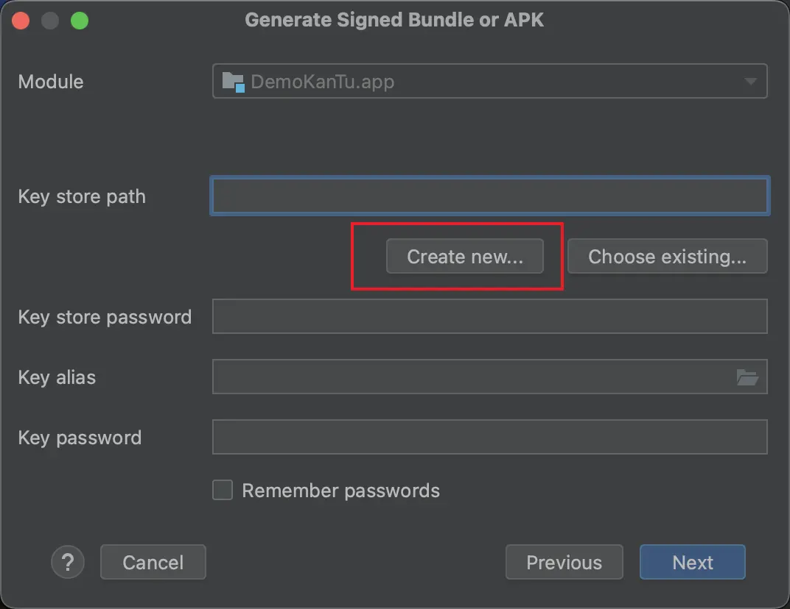
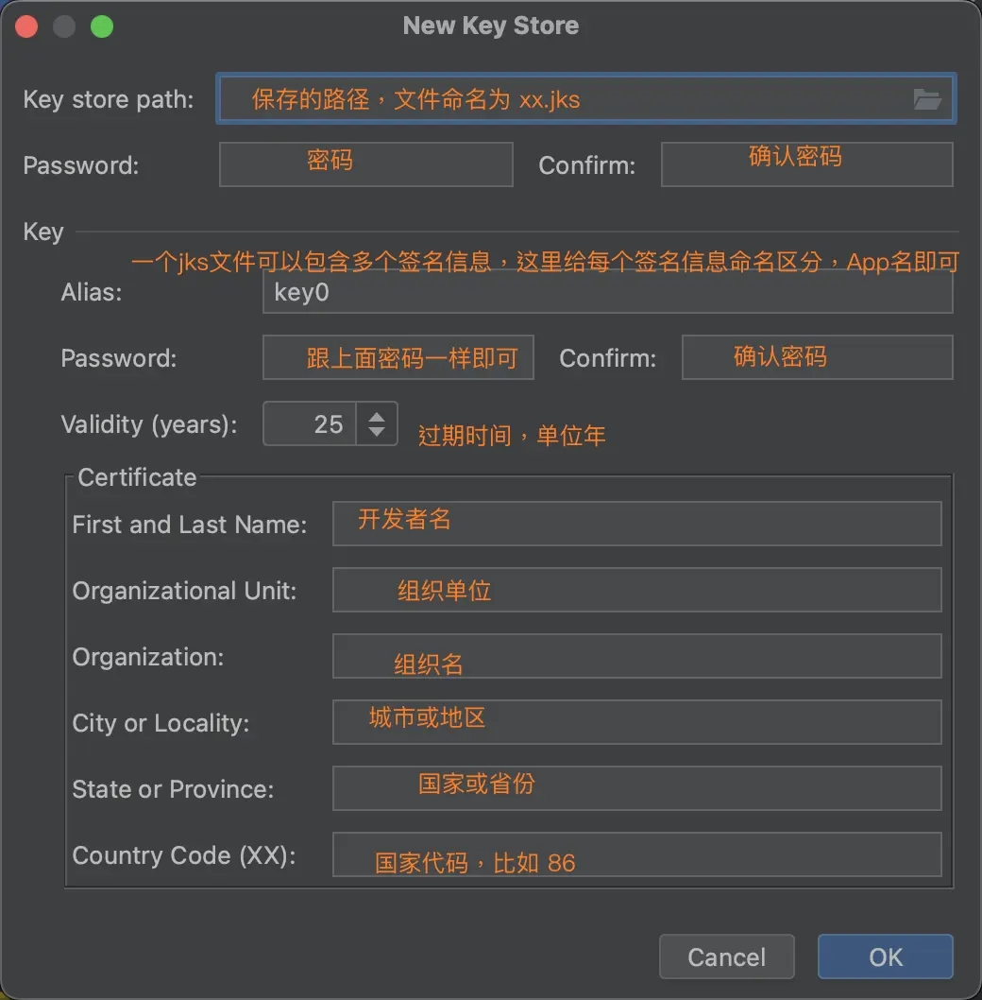
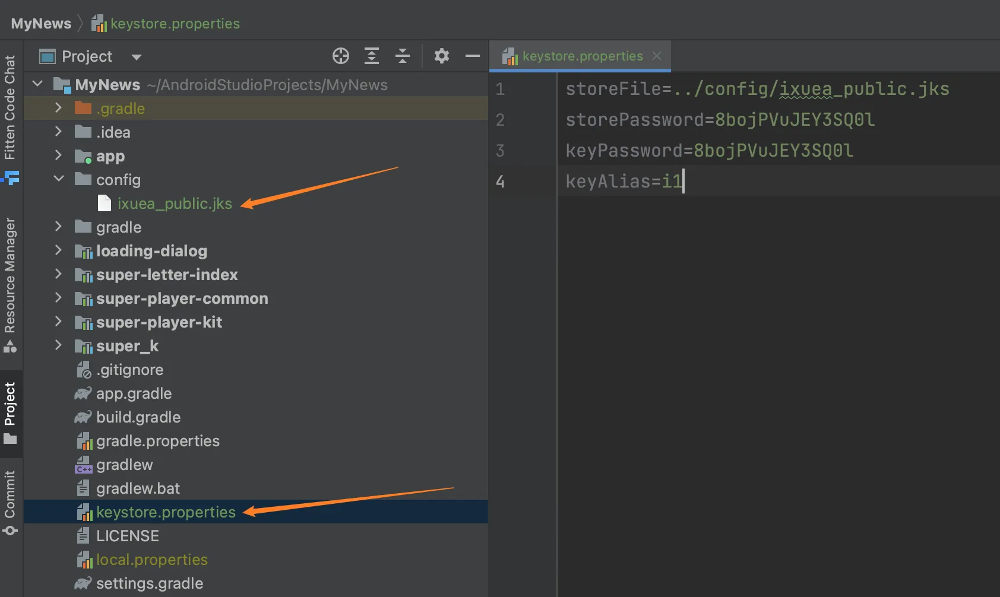
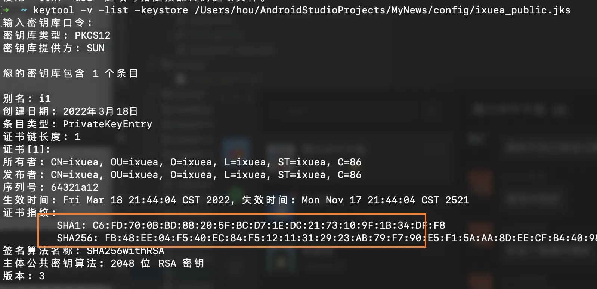
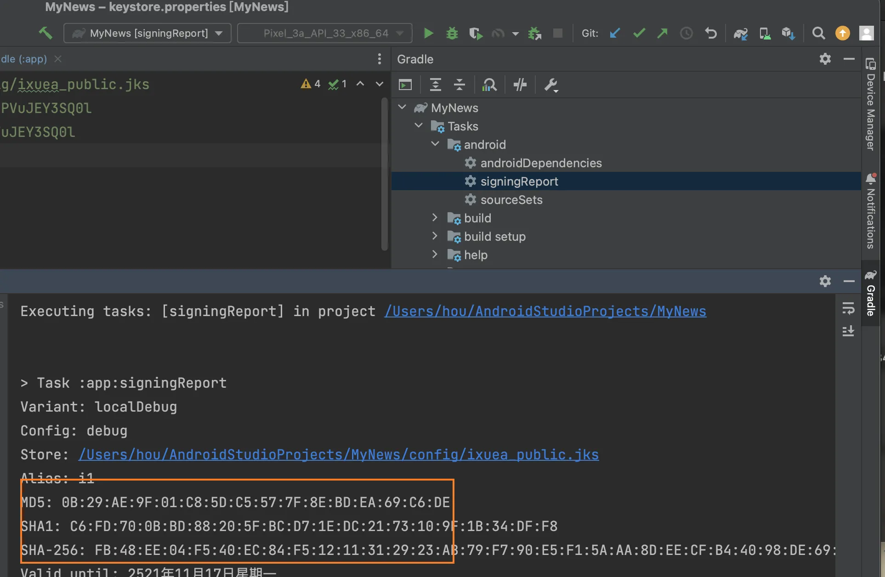
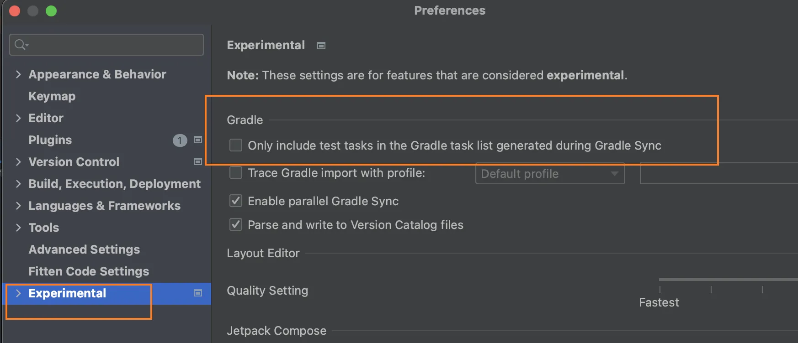

> 当前文件是`pack.md`

## 1.创建签名jks文件

### 1.1 Android Studio生成
`Build` -> `Generate Signed Bundlle / APK`，选择`APK`点击`Next`下一步：

<p align="center">
  
</p>

<p align="center">
  
</p>

## 2.项目使用签名文件

<p align="center">
  
</p>

如图所示，将签名jks文件和一个签名的配置文件放到了项目中，这里使用`keystore.properties`配置文件是为了不将密码等硬编码到`build.gradle`文件里。

既然定义了`keystore.properties`文件，就需要在编译的时候读取签名文件，在项目`app`的`build.gradle`中，`android {...}` 函数的上面，定义如下的读取`*.properties`的代码：

```py
// region 加载签名配置文件
// 加载签名配置文件信息
// 目的是把敏感信息放到单独的文件防止泄漏，所以像keystore.properties这样的文件
// 在真实项目中不要提交到版本控制，而是采用更安全的方法（不同的企业可能不一样）保存，最后分发到开发电脑
// 不过在中小型公司都是和源码保存到一起
def keystorePropertiesFile = rootProject.file("keystore.properties")

// 初始化配置类
def keystoreProperties = new Properties()

// 从文件中加载配置
keystoreProperties.load(new FileInputStream(keystorePropertiesFile))
// endregion
```


在`build.gradle`文件中，`android {...}`函数中，进行签名配置，不过需要写在`buildTypes {}`之前，内容下：
```py
// 签名配置 - 要写到使用签名配置的前面
signingConfigs {
    // 以下两个版本都用的是同一个 。 真实项目中可能会用多个
    debug {
//        // 方案一，直接读取jks文件，和签名密码等。签名文件路径，根目录：config/ixuea_public.jks
//        storeFile file("../config/ixuea_public.jks")
//        // key密码
//        storePassword "8bojPVuJEY3SQ0l"
//        // 别名
//        keyAlias "i1"
//        // 签名密码
//        keyPassword "8bojPVuJEY3SQ0l"

        // 方案二，从配置文件中获取。（上面定义好了keystoreProperties）
        storeFile file(keystoreProperties['storeFile'])
        storePassword keystoreProperties['storePassword']
        keyAlias keystoreProperties['keyAlias']
        keyPassword keystoreProperties['keyPassword']
    }

    // 正式版签名
    release {
        storeFile file(keystoreProperties['storeFile'])
        storePassword keystoreProperties['storePassword']
        keyAlias keystoreProperties['keyAlias']
        keyPassword keystoreProperties['keyPassword']
    }
}
```

最后一步，前面这些定义，都是准备和定义签名信息，下面就将签名加到编译里面：

在`build.gradle`文件中，`buildTypes {...}`函数中

```py
buildTypes {
    debug {  // debug编译时
        minifyEnabled false
        proguardFiles getDefaultProguardFile('proguard-android-optimize.txt'), 'proguard-rules.pro'
        // 签名配置
        signingConfig signingConfigs.debug
    }

    release {  // release编译时
        minifyEnabled false
        proguardFiles getDefaultProguardFile('proguard-android-optimize.txt'), 'proguard-rules.pro'

        // 签名配置
        signingConfig signingConfigs.release
    }
}
```

## 3.查看签名信息

### 3.1 命令获取
```sh
keytool -v -list -keystore 签名文件
# 回车之后，输入密码即可看到，如下图所示
```

<p align="center">
  
</p>

### 3.2 代码获取

App运行中，可以通过代码来获取，这个网上搜索即可。

### 3.3 Gradle打印
如下图所示，执行`gradle`的一个签名`Task`即可：
<p align="center">
  
</p>

如果没有这个`Task`，可以尝试搜索，或者在项目的`Setting`下面图中所示的地方看看：
<p align="center">
  
</p>


### 1.1 Clock和计时器

`TextClock`和`AnalogClock`都动态显示当前的时间。`TextClock`继承于`TextView`，以格式化文本的方式动态显示时间；`AnalogClock`继承于`View`，以模拟表盘的方式显示当前时间。
```xml

```

| `DatePicker`属性 | 属性含义 |
| --- | --- |
| android:firstDayOfWeek | 第一列为星期几，默认是星期日，比如2为星期一 |
| android:maxDate | 限制最大日期。"mm/dd/yyyy"格式 |
| android:minDate | 限制最小日期。"mm/dd/yyyy"格式 |


颜色
https://www.toolhelper.cn/Color/RGBToHex