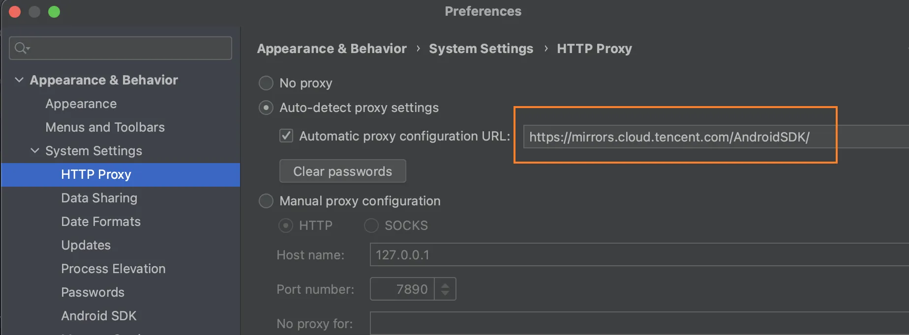

> 当前文件是`skill.md`

## 1.如何查看依赖最新版本

①： **Maven依赖** 👇🏻

托管到一个[`Maven`仓库](https://central.sonatype.com/)的依赖库，都可以使用如下方法查看。

打开`Maven`第三方仓库主页： https://mvnrepository.com  进行搜索即可。

(`Maven`可以简单理解为他就是一个git仓库，只要是`Gradle`使用的库一般都放到该仓库的)


②： **托管到jitpack** 👇🏻

由于将依赖发布到普通`Maven`仓库，还是比较麻烦，所以有些项目，可能托管到`jitpack`。

打开 https://jitpack.io  然后输入仓库`Github`地址，点击`Look up`即可查看最新版本。

## 2.常用adb命令

通过adb(Android Debug Bridge，Android调试桥，简单来讲通过他可以在电脑上对Android手机进行操作)来执行，他在`sdk/platform-tools/`目录中，也就是说他是安装到电脑上的：

```shell
adb devices：查看Android设备
adb -s 设备名称：如果有多个设备，可以通过该命令对指定的设备操作
adb start-server：开始adb服务，如果没开启，执行其他adb命令就会开始，所以该命令基本很少用到
adb kill-server :停止adb服务，有时候电脑有多个adb，会暂用端口，所以需终止再开启，看看问题能否解决
adb connect 192.168.1.99：通过wifi连接android设备，一般都是通过数据线，现在很多真机云测，可以远程连接
adb disconnect 192.168.1.99：断开连接
```

**install & uninstall**
```shell
adb install xxx.apk：安装apk
adb install -r xxx.apk：覆盖安装
adb uninstall com.xx.xxx：卸载应用，后面是包名
```

**push/pull** 推送/下载文件
```bash
adb push xxx.apk /sdcard/  # 将xxx.apk推送到/sdcard/目录
adb push files/ /sdcard/files/  # 将files文件夹推送到/sdcard/files目录，所有文件，包括子文件夹

adb pull /sdcard/xxx.apk ./  # 将/sdcard/目录中的xxx.apk下载到当前目录中
adb pull /sdcard/xxx.apk ./a.apk  # 同上，改名为a.apk
adb pull /sdcard/files/ ./  # 将/sdcard/files目录中下载到当前目录中
adb pull /sdcard/files/ ./newdir  # 同上，改名为newdir
```

手机***shell***
```shell
# 相当于进入了Android手机中的Linux环境，可以执行一些Linux命令，
# 不过比较少，如果是做安全逆向，可以在手机上BusyBox，他内置了很多命令，这样就添加Android默认没有的命令。
adb shell

exit  # 退出adb的shell模式
```

## 3.允许HTTP

在`AndroidManifest.xml`中添加`usesCleartextTraffic`属性：

```xml
<application
    android:usesCleartextTraffic="true" />
```

## 3.开发镜像

### 3.1 Gradle镜像
在项目目录的`gradle` -> `wrapper` -> `gradle-wrapper.properties`中，修改`gradle`的地址即可：
```g
# 例如替换为腾讯源：

# 这个是默认的 gradle.org 网址
# distributionUrl=https\://services.gradle.org/distributions/gradle-8.0-bin.zip

# 下面这个是腾讯源
distributionUrl=https\://mirrors.cloud.tencent.com/gradle/gradle-8.0-bin.zip
```

### 3.2 Android SDK镜像
在`Android Studio`设置中：`Settings` --> `Appearance & Behavior` --> `Systenm Settings` --> `HTTP Proxy`页面里面：

可以将代理地址改为腾讯源或者阿里源，例如：
```
# 腾讯
https://mirrors.cloud.tencent.com/AndroidSDK/

# 阿里云
https://mirrors.aliyun.com/android.googlesource.com/
```




## 2.XXOO

### 1.1 Clock和计时器

`TextClock`和`AnalogClock`都动态显示当前的时间。`TextClock`继承于`TextView`，以格式化文本的方式动态显示时间；`AnalogClock`继承于`View`，以模拟表盘的方式显示当前时间。
```xml

```

| `DatePicker`属性 | 属性含义 |
| --- | --- |
| android:firstDayOfWeek | 第一列为星期几，默认是星期日，比如2为星期一 |
| android:maxDate | 限制最大日期。"mm/dd/yyyy"格式 |
| android:minDate | 限制最小日期。"mm/dd/yyyy"格式 |


颜色
https://www.toolhelper.cn/Color/RGBToHex